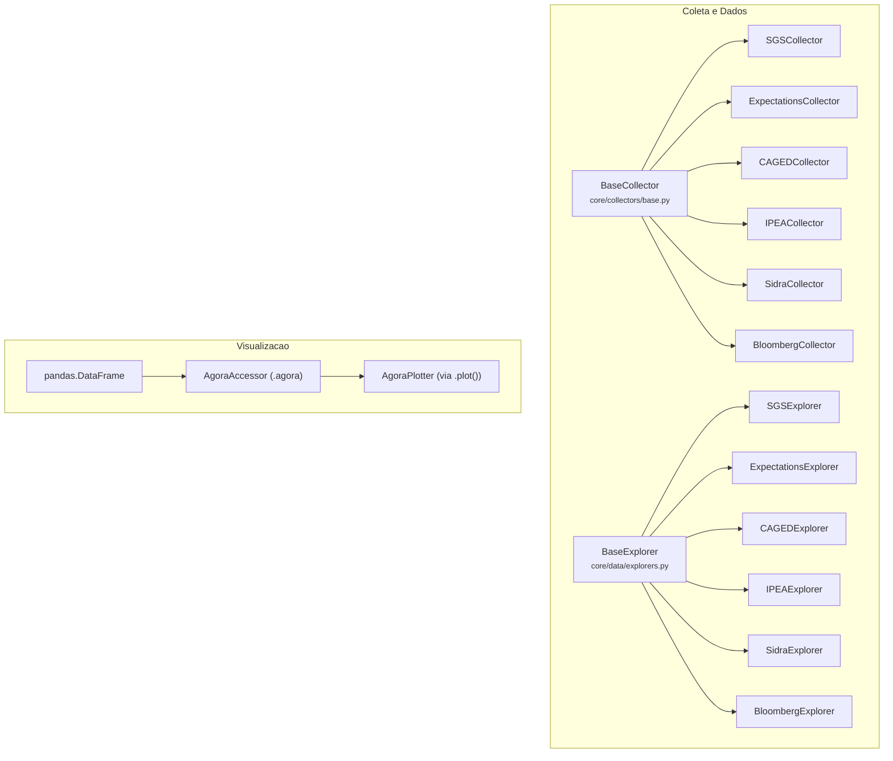
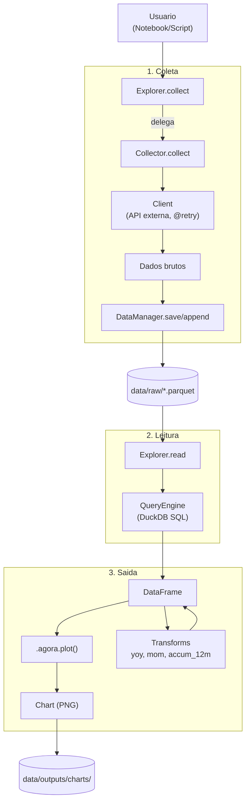

# Arquitetura do Projeto agora-database

Visao geral da estrutura, funcionamento e componentes principais do repositorio.

## Visao Geral

Projeto para coleta, armazenamento e visualizacao de dados economicos brasileiros. Suporta seis fontes de dados e oferece ferramentas integradas de analise e plotagem.

### Fontes de Dados Suportadas

| Fonte | Modulo | Descricao | Docs |
|-------|--------|-----------|------|
| BCB - SGS | `src/adb/bacen/sgs/` | Series temporais (Selic, CDI, IPCA, cambio) | [bacen.md](bacen.md) |
| BCB - Focus | `src/adb/bacen/expectations/` | Expectativas de mercado | [bacen.md](bacen.md) |
| MTE - CAGED | `src/adb/mte/caged/` | Microdados de emprego formal | [mte.md](mte.md) |
| IPEA | `src/adb/ipea/` | Dados agregados de emprego | [ipea.md](ipea.md) |
| IBGE - SIDRA | `src/adb/ibge/sidra/` | Dados demograficos e economicos (IPCA, PIB) | [ibge.md](ibge.md) |
| Bloomberg | `src/adb/bloomberg/` | Dados de mercado financeiro (Terminal) | [bloomberg.md](bloomberg.md) |

---

## Estrutura de Pastas

```
agora-database/
├── src/
│   └── adb/                      # Pacote raiz
│       ├── __init__.py           # Exports do pacote (explorers, config)
│       ├── core/                 # Modulo central (Core Services)
│       │   ├── __init__.py       # API publica centralizada
│       │   ├── config.py         # Configuracao global (paths, timeouts)
│       │   ├── log.py            # Sistema de logging (arquivo + console)
│       │   ├── resilience.py     # Retry, backoff e tratamento de erros
│       │   ├── exceptions.py     # Excecoes customizadas (ADBException)
│       │   ├── collectors/       # Abstracao de coleta
│       │   ├── data/             # Persistencia e queries
│       │   ├── charting/         # Visualizacao
│       │   └── utils/            # Utilitarios gerais
│       ├── bacen/                # Modulo BCB (SGS + Expectations)
│       ├── mte/                  # Modulo MTE (CAGED)
│       ├── ipea/                 # Modulo IPEA
│       ├── ibge/                 # Modulo IBGE (SIDRA)
│       └── bloomberg/            # Modulo Bloomberg
├── data/                         # Dados armazenados
│   ├── raw/                      # Dados brutos (Parquet/Snappy)
│   └── outputs/
│       └── charts/               # Graficos exportados (PNG)
├── logs/                         # Logs de execucao
├── notebooks/                    # Jupyter notebooks
├── scripts/                      # Scripts de automacao
└── docs/                         # Documentacao
```

---

## Arquitetura de Componentes

O projeto segue uma arquitetura em camadas com separacao clara de responsabilidades.

### Hierarquia de Classes



### Componentes Principais

| Componente | Localizacao | Responsabilidade |
|------------|-------------|------------------|
| **BaseCollector** | `core/collectors/base.py` | Classe base para coleta de dados |
| **BaseExplorer** | `core/data/explorers.py` | Interface unificada para leitura/coleta |
| **DataManager** | `core/data/storage.py` | Persistencia I/O (Parquet) |
| **QueryEngine** | `core/data/query.py` | Consultas SQL (DuckDB) |
| **AgoraPlotter** | `core/charting/engine.py` | Motor de visualizacao |

Para documentacao detalhada de cada componente, consulte [core.md](core.md).

---

## Fluxo de Dados

Do download a visualizacao:



### Relacao Explorer-Collector

O **Explorer** e a interface publica para o usuario. Ele **delega** a coleta para o **Collector**:

- `Explorer.read()` → Le dados salvos via QueryEngine
- `Explorer.collect()` → Instancia o Collector e dispara coleta
- `Collector.collect()` → Baixa dados via Client e salva via DataManager

---

## Padrao de Uso

### Coleta e Leitura de Dados

```python
import adb

# Coleta (Incremental + Retry automatico)
adb.sgs.collect(['selic', 'cdi'])
adb.caged.collect()

# Leitura (via Explorer -> QueryEngine)
df = adb.sgs.read('selic', start='2023-01-01')
df = adb.sgs.read('selic', 'cdi')  # Multiplos indicadores

# Listar indicadores disponiveis
adb.sgs.available()
adb.sgs.info('selic')
```

### Visualizacao

```python
import adb
import adb.core.charting  # Registra o accessor 'agora'
from adb.core.charting import yoy, mom, accum_12m

df = adb.sgs.read('selic', start='2020')

# Plotagem basica
df.agora.plot(title="Selic", kind='line')

# Com transformacao
yoy(df).agora.plot(title="Selic - Variacao Anual")
```

---

## Padroes de Projeto

| Padrao | Uso |
|--------|-----|
| **Template Method** | BaseCollector define estrutura, subclasses implementam `collect()` |
| **Facade** | Explorers simplificam acesso a Collectors + QueryEngine |
| **Lazy Loading** | Exploradores carregados sob demanda |
| **Decorator** | `@retry` para resiliencia de rede |
| **Pandas Accessor** | `df.agora` para plotagem integrada |

---

## Extensibilidade

### Adicionar Novo Indicador

Edite o `indicators.py` do modulo especifico (ex: `src/adb/bacen/sgs/indicators.py`).

### Adicionar Nova Fonte

1. Crie o pacote em `src/adb/nova_fonte/`
2. Implemente: `client.py`, `indicators.py`, `collector.py`, `explorer.py`
3. Registre o collector em `src/adb/core/collectors/registry.py`
4. Exporte o explorer em `src/adb/__init__.py`

Para detalhes de implementacao, consulte [core.md](core.md).

---

## Documentacao Relacionada

| Doc | Conteudo |
|-----|----------|
| [core.md](core.md) | API completa do modulo central (collectors, data, utils) |
| [charting.md](charting.md) | Sistema de visualizacao |
| [bacen.md](bacen.md) | Coletor BCB (SGS + Expectations) |
| [ibge.md](ibge.md) | Coletor IBGE/SIDRA |
| [ipea.md](ipea.md) | Coletor IPEA |
| [mte.md](mte.md) | Coletor MTE/CAGED |
| [bloomberg.md](bloomberg.md) | Coletor Bloomberg |
