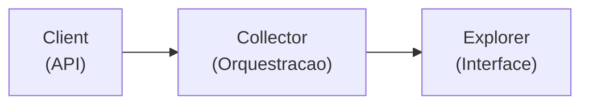

# Modulo BCB (Banco Central do Brasil)

Documentacao dos coletores de dados do Banco Central: SGS e Expectations.

## Visao Geral

O modulo `src/adb/bacen/` contem dois submodulos principais:

| Submodulo | Fonte | Descricao |
|-----------|-------|-----------|
| `sgs/` | API SGS | Series temporais (Selic, CDI, IPCA, cambio, IBC-Br) |
| `expectations/` | API Focus | Expectativas de mercado (relatorio Focus) |

---

## Uso Basico

O projeto usa uma arquitetura centralizada baseada em **Explorers**. O acesso padrao e feito via `adb`:

### Coleta de Dados

```python
import adb

# SGS - Series temporais
adb.sgs.collect()                          # Todos indicadores
adb.sgs.collect('selic')                   # Um indicador
adb.sgs.collect(['selic', 'cdi'])          # Lista

# Expectations - Relatorio Focus
adb.expectations.collect()                 # Todos
adb.expectations.collect('ipca_anual')
```

### Leitura de Dados

```python
import adb

# SGS Explorer
df = adb.sgs.read('selic')                 # Leitura simples
df = adb.sgs.read('selic', start='2020')   # Com filtro de data
df = adb.sgs.read('selic', 'cdi')          # Multiplos indicadores
print(adb.sgs.available())                 # Lista indicadores disponiveis
print(adb.sgs.info('selic'))               # Info do indicador

# Expectations Explorer
df = adb.expectations.read('ipca_anual')
df = adb.expectations.read('ipca_anual', start='2024')
print(adb.expectations.available())
```

---

## SGS (Sistema Gerenciador de Series)

### Indicadores Disponiveis

Configurados em `src/adb/bacen/sgs/indicators.py`:

**Diarios:**

| Chave | Codigo | Nome | Descricao |
|-------|--------|------|-----------|
| `selic` | 432 | Meta Selic | Taxa basica de juros da economia brasileira |
| `selic_acum_mensal` | 4390 | Selic Acumulada no Mes | Taxa de juros acumulada no mes |
| `cdi` | 12 | CDI | Certificado de Deposito Interbancario - Taxa Diaria |
| `dolar_ptax` | 10813 | Dolar PTAX | Taxa de cambio Dolar/Real - PTAX Venda |
| `euro_ptax` | 21619 | Euro PTAX | Taxa de cambio Euro/Real - PTAX Venda |

**Mensais:**

| Chave | Codigo | Nome | Descricao |
|-------|--------|------|-----------|
| `ibc_br_bruto` | 24363 | IBC-Br Bruto | Indice de Atividade Economica - Bruto |
| `ibc_br_dessaz` | 24364 | IBC-Br Dessazonalizado | Indice de Atividade Economica - Dessazonalizado |
| `igp_m` | 189 | IGP-M | Indice Geral de Precos do Mercado |
| `ibc_br_agro` | 29602 | IBC-Br Agropecuaria | IBC-Br Setor Agropecuario - Dessazonalizado |
| `ibc_br_industria` | 29604 | IBC-Br Industria | IBC-Br Setor Industrial - Dessazonalizado |
| `ibc_br_servicos` | 29606 | IBC-Br Servicos | IBC-Br Setor de Servicos - Dessazonalizado |

### Funcoes Auxiliares

```python
import adb

adb.sgs.available()                        # Lista todas as chaves
adb.sgs.info('selic')                      # Config do indicador
adb.sgs.available(frequency='daily')       # Filtra por frequencia
```

---

## Expectations (Relatorio Focus)

### Indicadores Disponiveis

Configurados em `src/adb/bacen/expectations/indicators.py`:

**Anuais (Top 5 previsores):**

| Chave | Endpoint | Indicador | Descricao |
|-------|----------|-----------|-----------|
| `ipca_anual` | top5_anuais | IPCA | Expectativa IPCA anual |
| `igpm_anual` | top5_anuais | IGP-M | Expectativa IGP-M anual |
| `pib_anual` | top5_anuais | PIB Total | Expectativa PIB anual |
| `cambio_anual` | top5_anuais | Cambio | Expectativa Cambio fim de ano |
| `selic_anual` | top5_anuais | Selic | Expectativa Selic fim de ano |

**Mensais:**

| Chave | Endpoint | Indicador | Descricao |
|-------|----------|-----------|-----------|
| `ipca_mensal` | mensais | IPCA | Expectativa IPCA mensal |
| `igpm_mensal` | mensais | IGP-M | Expectativa IGP-M mensal |
| `cambio_mensal` | mensais | Cambio | Expectativa Cambio mensal |

**Selic e Inflacao:**

| Chave | Endpoint | Indicador | Descricao |
|-------|----------|-----------|-----------|
| `selic` | selic | Selic | Expectativa Selic por reuniao COPOM |
| `ipca_12m` | inflacao_12m | IPCA | Expectativa IPCA acumulado 12 meses |
| `ipca_24m` | inflacao_24m | IPCA | Expectativa IPCA acumulado 24 meses |
| `igpm_12m` | inflacao_12m | IGP-M | Expectativa IGP-M acumulado 12 meses |

### Leitura Avancada (Expectations)

O `ExpectationsExplorer` oferece parametros adicionais para processamento:

```python
import adb

# Dados brutos (todas colunas)
df = adb.expectations.read('ipca_anual')

# Filtrar por ano de referencia
df = adb.expectations.read('selic_anual', year=2027)

# Filtrar por serie suavizada
df = adb.expectations.read('ipca_12m', smooth=True)
df = adb.expectations.read('ipca_12m', smooth=False)

# Escolher metrica (default: 'Mediana')
df = adb.expectations.read('ipca_12m', smooth=True, metric='Media')
df = adb.expectations.read('ipca_12m', smooth=True, metric='Minimo')
df = adb.expectations.read('ipca_12m', smooth=True, metric='Maximo')
```

**Assinatura completa:**
```python
def read(
    *indicators: str,
    start: str = None,
    end: str = None,
    columns: List[str] = None,
    year: int = None,           # Filtra por ano de referencia
    smooth: bool = None,        # Filtra por serie suavizada (Suavizada='S')
    metric: str = 'Mediana',    # Metrica: 'Mediana', 'Media', 'Minimo', 'Maximo'
) -> pd.DataFrame
```

---

## Uso Avancado (Acesso Direto)

Para casos especiais onde e necessario acesso direto aos collectors/clients:

### Collectors

```python
from adb.bacen.sgs.collector import SGSCollector
from adb.bacen.expectations.collector import ExpectationsCollector

# SGSCollector
collector = SGSCollector()
collector.collect('selic')
collector.get_status()

# ExpectationsCollector
collector = ExpectationsCollector()
collector.collect('ipca_anual')
```

### Clients (Baixo Nivel)

```python
from adb.bacen.sgs.client import SGSClient
from adb.bacen.expectations.client import ExpectationsClient

# SGSClient - busca series do BCB
client = SGSClient()
df = client.get_data(code=432, name='Selic', frequency='daily', start_date='2024-01-01')
df = client.get_series(codes={'selic': 432, 'cdi': 12})

# ExpectationsClient - busca expectativas Focus
client = ExpectationsClient()
df = client.query(endpoint_key='top5_anuais', indicator='IPCA', start_date='2024-01-01')
df = client.query(endpoint_key='selic', start_date='2024-01-01')
df = client.query(endpoint_key='inflacao_12m', indicator='IPCA', start_date='2024-01-01')
```

### Assinaturas dos Metodos Principais

**SGSClient.get_data():**
```python
def get_data(
    code: int,
    name: str,
    frequency: str,
    start_date: str = None,
    verbose: bool = False,
) -> pd.DataFrame
```

**SGSCollector.collect():**
```python
def collect(
    indicators: list[str] | str = 'all',
    save: bool = True,
    verbose: bool = True,
) -> None
```

**ExpectationsCollector.collect():**
```python
def collect(
    indicators: list[str] | str = 'all',
    save: bool = True,
    verbose: bool = True,
) -> None
```

---

## API Publica

```python
import adb

# SGS - Series temporais
adb.sgs.collect()                          # Coleta todos indicadores
adb.sgs.collect('selic')                   # Coleta um indicador
adb.sgs.read('selic')                      # Le dados
adb.sgs.read('selic', start='2020')        # Com filtro de data
adb.sgs.available()                        # Lista indicadores
adb.sgs.info('selic')                      # Detalhes do indicador
adb.sgs.get_status()                       # Status dos arquivos

# Expectations - Relatorio Focus
adb.expectations.collect()
adb.expectations.read('ipca_anual')
adb.expectations.available()
adb.expectations.info('ipca_anual')
```

---

## Arquivos Gerados

```
data/
└── raw/
    └── bacen/
        ├── sgs/
        │   ├── daily/        # selic.parquet, cdi.parquet, dolar_ptax.parquet, euro_ptax.parquet
        │   └── monthly/      # ibc_br_bruto.parquet, igp_m.parquet, ibc_br_agro.parquet, etc
        └── expectations/     # ipca_anual.parquet, selic.parquet, ipca_12m.parquet, etc
```

---

## Arquitetura Interna

Cada submodulo segue a arquitetura de tres camadas:



| Camada | SGS | Expectations |
|--------|-----|--------------|
| Client | `SGSClient` | `ExpectationsClient` |
| Collector | `SGSCollector(BaseCollector)` | `ExpectationsCollector(BaseCollector)` |
| Explorer | `SGSExplorer(BaseExplorer)` | `ExpectationsExplorer(BaseExplorer)` |
| Config | `SGS_CONFIG` (10 indicadores) | `EXPECTATIONS_CONFIG` (12 indicadores) |

Veja [architecture.md](architecture.md) para detalhes sobre `BaseCollector` e `BaseExplorer`.
