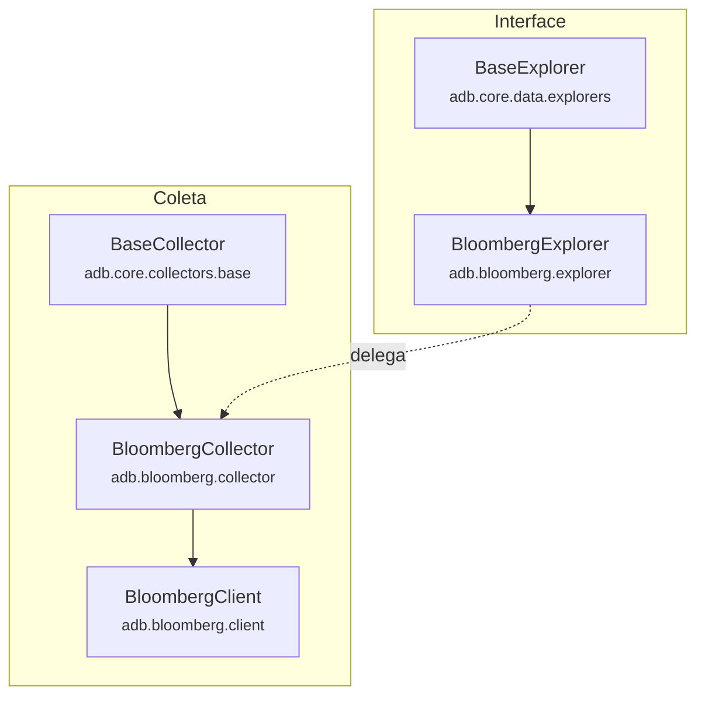
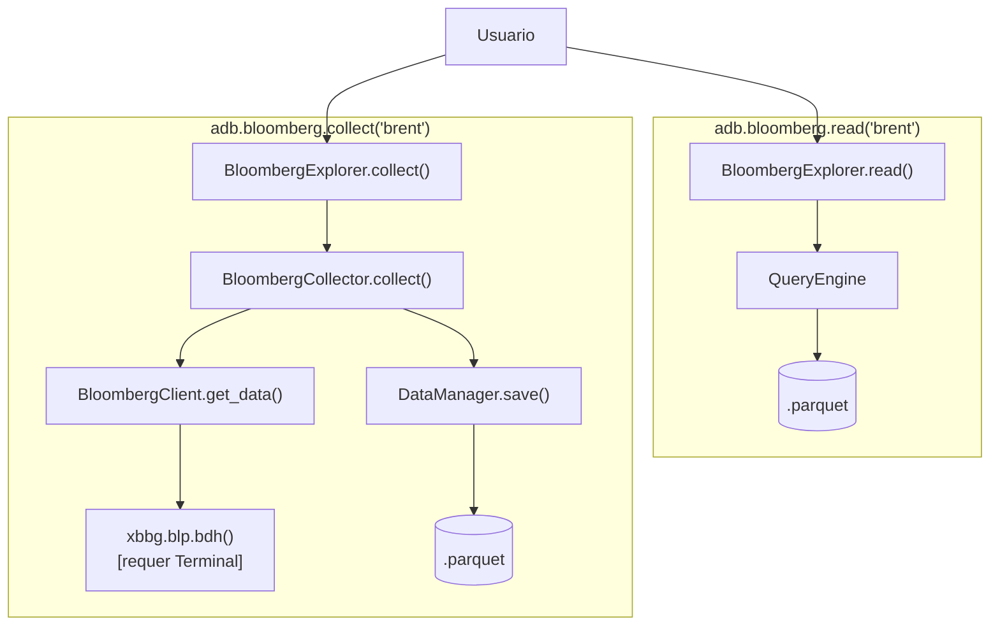

# Modulo Bloomberg Terminal

Documentacao do coletor de dados do Bloomberg Terminal.

## Visao Geral

O modulo `src/adb/bloomberg/` coleta dados de mercado financeiro via Bloomberg Terminal.

| Caracteristica | Valor |
|----------------|-------|
| Fonte | Bloomberg Terminal (xbbg) |
| Formato | Series temporais |
| Foco | Dados de mercado financeiro (equities, commodities) |
| Requisito | Bloomberg Terminal ativo para coleta; leitura funciona offline |

---

## Arquitetura de Uso

### Para Coleta de Dados

```python
import adb

adb.bloomberg.collect()                              # Todos indicadores
adb.bloomberg.collect(indicators='brent')            # Um indicador
adb.bloomberg.collect(indicators=['brent', 'gold'])  # Lista
```

### Para Leitura/Queries (Explorer)

```python
import adb

df = adb.bloomberg.read('brent')                    # Leitura simples
df = adb.bloomberg.read('brent', start='2024')      # Com filtro de data
df = adb.bloomberg.read('brent', 'gold')            # Multiplos indicadores
print(adb.bloomberg.available())                    # Lista indicadores
print(adb.bloomberg.available(category='commodities'))  # Por categoria
print(adb.bloomberg.info('brent'))                  # Info do indicador
adb.bloomberg.get_status()                          # Status dos arquivos
```

---

## BLOOMBERG_CONFIG

Indicadores disponiveis em `src/adb/bloomberg/indicators.py`:

### Constantes

```python
LOOKBACK_DAYS = 730  # 2 anos de historico padrao
```

### Global Equities

| Chave | Ticker | Nome | Campo |
|-------|--------|------|-------|
| msci_acwi_mktcap | MXWD Index | MSCI ACWI - Market Cap | CUR_MKT_CAP |
| msci_acwi_pe | MXWD Index | MSCI ACWI - P/E Ratio | BEST_PE_RATIO |
| msci_acwi_dividend | MXWD Index | MSCI ACWI - Dividend Yield | EQY_DVD_YLD_12M |

### Brasil Equities

| Chave | Ticker | Nome | Campo |
|-------|--------|------|-------|
| ibov_points | IBOV Index | Ibovespa - Pontos | PX_LAST |
| ibov_usd | USIBOV Index | Ibovespa - USD | PX_LAST |
| ifix | IFIX Index | IFIX | PX_LAST |

### Commodities

| Chave | Ticker | Nome | Campo |
|-------|--------|------|-------|
| brent | CO1 Comdty | Brent Crude | PX_LAST |
| iron_ore | SCOA Comdty | Iron Ore | PX_LAST |
| gold | XAU Curncy | Gold Spot | PX_LAST |

### Estrutura de Configuracao

Cada entrada em `BLOOMBERG_CONFIG` segue o formato:

```python
"indicator_key": {
    "ticker": "TICKER Index",       # Ticker Bloomberg
    "fields": ["PX_LAST"],          # Lista de campos a coletar
    "name": "Nome Legivel",
    "frequency": "daily",
    "description": "Descricao do indicador",
    "category": "categoria",        # global_equities, brazil_equities, commodities
}
```

---

## Uso Avancado (Acesso Direto)

Para casos especiais:

### BloombergCollector

```python
from adb.bloomberg.collector import BloombergCollector

collector = BloombergCollector(data_path='data/')
collector.collect('brent')                     # Coleta um indicador
collector.collect(['brent', 'gold'])           # Coleta lista
collector.collect()                            # Coleta todos
collector.get_status()                         # Status dos arquivos
```

#### Assinatura: BloombergCollector.collect()

```python
def collect(
    self,
    indicators: list[str] | str = "all",
    save: bool = True,
    verbose: bool = True,
) -> None
```

**Nota:** O metodo `collect()` nao retorna dados; ele salva diretamente em Parquet.

### BloombergClient

```python
from adb.bloomberg.client import BloombergClient

client = BloombergClient()
df = client.get_data(
    ticker='CO1 Comdty',
    field='PX_LAST',
    name='Brent',
    start_date='2024-01-01',
)

# Reference data (ponto unico, nao serie temporal)
ref = client.get_reference_data(
    tickers=['IBOV Index', 'MXWD Index'],
    fields=['NAME', 'SECURITY_TYP'],
)
```

#### Assinatura: BloombergClient.get_data()

```python
@retry(max_attempts=2, delay=1.0, exceptions=(RuntimeError, TimeoutError, OSError))
def get_data(
    self,
    ticker: str,
    field: str,
    name: str = None,
    start_date: str = None,     # None = LOOKBACK_DAYS atras (730 dias)
    end_date: str = None,       # None = hoje
    verbose: bool = False,      # Deprecado
) -> pd.DataFrame
```

**Retorna:** DataFrame com DatetimeIndex (nome='date') e coluna 'value'. DataFrame vazio em caso de erro.

#### Assinatura: BloombergClient.get_reference_data()

```python
def get_reference_data(
    self,
    tickers: list[str] | str,
    fields: list[str] | str,
) -> pd.DataFrame
```

**Retorna:** DataFrame com tickers no index e fields nas colunas.

---

## Arquitetura Interna

### Hierarquia de Classes



### BloombergExplorer

Interface pythonica para leitura de dados. Herda de `BaseExplorer`.

```python
class BloombergExplorer(BaseExplorer):
    _CONFIG = BLOOMBERG_CONFIG
    _SUBDIR = "bloomberg/daily"

    @property
    def _COLLECTOR_CLASS(self):
        from adb.bloomberg.collector import BloombergCollector
        return BloombergCollector
```

**Metodos herdados:**
- `read(*indicators, start, end, columns)` - Le dados via QueryEngine
- `available(**filters)` - Lista indicadores disponiveis
- `info(indicator)` - Retorna config do indicador
- `collect(indicators, save, verbose)` - Delega para BloombergCollector
- `get_status()` - Status dos arquivos salvos

### Fluxo de Dados



---

## API Publica

```python
import adb

adb.bloomberg.collect()                      # Coleta todos indicadores
adb.bloomberg.collect('brent')               # Coleta um indicador
adb.bloomberg.read('brent')                  # Le dados
adb.bloomberg.read('brent', start='2020')    # Com filtro de data
adb.bloomberg.available()                    # Lista indicadores
adb.bloomberg.info('brent')                  # Detalhes do indicador
adb.bloomberg.get_status()                   # Status dos arquivos
```

---

## Arquivos Gerados

```
data/
└── raw/
    └── bloomberg/
        └── daily/
            ├── msci_acwi_mktcap.parquet
            ├── msci_acwi_pe.parquet
            ├── msci_acwi_dividend.parquet
            ├── ibov_points.parquet
            ├── ibov_usd.parquet
            ├── ifix.parquet
            ├── brent.parquet
            ├── iron_ore.parquet
            └── gold.parquet
```

---

## Extensibilidade

Para adicionar novos tickers Bloomberg:

```python
# Em src/adb/bloomberg/indicators.py
BLOOMBERG_CONFIG['novo_ticker'] = {
    'ticker': 'TICKER Index',       # Ticker Bloomberg
    'fields': ['PX_LAST'],          # Lista de campos a coletar
    'name': 'Nome Legivel',
    'frequency': 'daily',
    'description': 'Descricao',
    'category': 'categoria',        # global_equities, brazil_equities, commodities
}
```

---

## Resiliencia

O `BloombergClient` usa o decorator `@retry` para lidar com instabilidades:

- **max_attempts:** 2 tentativas
- **delay:** 1.0 segundo entre tentativas
- **exceptions:** `RuntimeError`, `TimeoutError`, `OSError`

A coleta e incremental: se ja existem dados salvos, busca apenas registros novos desde a ultima data.

### Captura de Output do SDK

O SDK `xbbg` gera mensagens de debug no stdout/stderr que podem poluir o terminal. O `BloombergClient` usa um context manager interno para capturar essas mensagens e redirecionalas para o arquivo de log, mantendo o terminal limpo durante a coleta.

---

## Requisitos

1. **Bloomberg Terminal ativo** (licenca necessaria) - apenas para coleta
2. **xbbg** instalado: `pip install xbbg`

**Nota:** O Bloomberg Terminal precisa estar aberto e conectado para que a coleta funcione. A leitura de dados ja salvos funciona offline.
