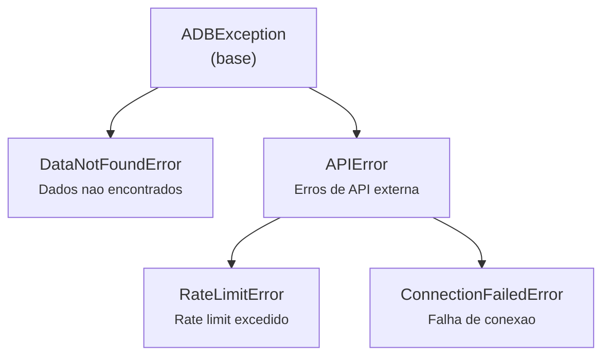

# Modulo Core (adb.core)

Documentacao do modulo central do projeto agora-database.

---

## Visao Geral

O modulo `adb.core` fornece a infraestrutura compartilhada por todos os coletores e exploradores de dados. Inclui:

- **Configuracao** - Paths e constantes globais
- **Logging** - Sistema centralizado com rotacao de arquivos
- **Resiliencia** - Retry com backoff exponencial para APIs
- **Excecoes** - Hierarquia de erros customizados
- **Collectors** - Classe base para coleta de dados
- **Data** - Persistencia (DataManager), queries (QueryEngine) e exploradores (BaseExplorer)
- **Utils** - Funcoes auxiliares de datas e indicadores
- **Charting** - Sistema de visualizacao (ver [charting.md](charting.md))

### Estrutura de Arquivos

```
src/adb/core/
├── __init__.py           # API publica centralizada
├── config.py             # Configuracao global (paths, timeouts)
├── log.py                # Sistema de logging
├── resilience.py         # Decorator @retry
├── exceptions.py         # Excecoes customizadas
├── collectors/
│   ├── base.py           # BaseCollector
│   └── registry.py       # Registro de collectors
├── data/
│   ├── storage.py        # DataManager (I/O Parquet)
│   ├── query.py          # QueryEngine (DuckDB)
│   └── explorers.py      # BaseExplorer
├── utils/
│   ├── dates.py          # parse_date, normalize_date_index
│   └── indicators.py     # list_indicators, get_indicator_config
└── charting/             # Ver charting.md
```

---

## Imports Principais

```python
# Classes de dados
from adb.core import DataManager, QueryEngine, BaseCollector

# Funcoes auxiliares
from adb.core import list_indicators, get_indicator_config, filter_by_field

# Configuracao
from adb.core import PROJECT_ROOT, DATA_PATH

# Exploradores (lazy-loaded)
from adb.core.data import sgs, caged, expectations, ipea, bloomberg, sidra

# Logging e resiliencia (uso interno/avancado)
from adb.core.log import get_logger
from adb.core.resilience import retry

# Excecoes
from adb.core.exceptions import ADBException, DataNotFoundError, APIError
```

---

## core.config

**Localizacao:** `src/adb/core/config.py`

Configuracao global do projeto com deteccao automatica do diretorio raiz.

### Constantes de Path

| Constante | Descricao |
|-----------|-----------|
| `PROJECT_ROOT` | Raiz do projeto (detecta `pyproject.toml` ou `.git`) |
| `DATA_PATH` | Diretorio de dados (`{PROJECT_ROOT}/data`) |
| `OUTPUTS_PATH` | Diretorio de saidas (`{PROJECT_ROOT}/data/outputs`) |
| `LOG_PATH` | Diretorio de logs (`{PROJECT_ROOT}/logs`) |

### Constantes de Resiliencia

| Constante | Valor | Descricao |
|-----------|-------|-----------|
| `DEFAULT_REQUEST_TIMEOUT` | 30 | Timeout HTTP em segundos |
| `DEFAULT_RETRY_ATTEMPTS` | 3 | Tentativas maximas |
| `DEFAULT_RETRY_DELAY` | 1.0 | Delay inicial em segundos |
| `DEFAULT_BACKOFF_FACTOR` | 2.0 | Multiplicador de backoff |
| `DEFAULT_CHUNK_DELAY` | 2.0 | Delay entre chunks de requisicoes |

```python
from adb.core import PROJECT_ROOT, DATA_PATH

print(PROJECT_ROOT)  # Path do diretorio raiz
print(DATA_PATH)     # Path do diretorio de dados
```

---

## core.log

**Localizacao:** `src/adb/core/log.py`

Sistema de logging centralizado com saida dual (arquivo + console).

### get_logger(name, verbose=True)

Cria ou retorna logger configurado.

| Parametro | Tipo | Default | Descricao |
|-----------|------|---------|-----------|
| name | str | - | Nome do logger (geralmente `__name__`) |
| verbose | bool | True | Habilita saida no console |

**Retorno:** `logging.Logger`

**Caracteristicas:**
- **Arquivo:** DEBUG+, rotacao 10MB, 5 backups em `logs/adb_YYYY-MM-DD.log`
- **Console:** INFO+ (apenas se `verbose=True`)
- **Formato:** `[YYYY-MM-DD HH:MM:SS] LEVEL [logger_name] message`

```python
from adb.core.log import get_logger

logger = get_logger(__name__)
logger.info("Iniciando coleta...")
logger.debug("Detalhes tecnicos")  # Apenas no arquivo
```

---

## core.resilience

**Localizacao:** `src/adb/core/resilience.py`

Decorator para retry automatico com backoff exponencial.

### @retry()

| Parametro | Tipo | Default | Descricao |
|-----------|------|---------|-----------|
| max_attempts | int | 3 | Numero maximo de tentativas |
| delay | float | 1.0 | Delay inicial em segundos |
| backoff_factor | float | 2.0 | Multiplicador do delay |
| exceptions | tuple | TRANSIENT_EXCEPTIONS | Excecoes que disparam retry |
| jitter | bool | True | Adiciona variacao aleatoria (0.5x-1.5x) |

**Excecoes Transientes (retry automatico):**
- `requests.RequestException`, `ConnectionError`, `Timeout`
- `urllib3.exceptions.HTTPError`
- `OSError`, `TimeoutError`
- `json.JSONDecodeError`, `ValueError`

```python
from adb.core.resilience import retry

@retry(max_attempts=3, delay=1.0)
def fetch_data(url):
    return requests.get(url, timeout=30)
```

---

## core.exceptions

**Localizacao:** `src/adb/core/exceptions.py`

Hierarquia de excecoes customizadas.



```python
from adb.core.exceptions import DataNotFoundError, APIError

try:
    df = explorer.read('indicador_inexistente')
except DataNotFoundError as e:
    print(f"Dados nao encontrados: {e}")
```

---

## core.collectors

**Localizacao:** `src/adb/core/collectors/`

Sistema de coleta de dados com classe base e registro de collectors.

### BaseCollector

Classe base para todos os coletores. Fornece:
- Logging padronizado
- Coleta incremental automatica
- Gerenciamento de status

#### Atributos de Classe

| Atributo | Tipo | Descricao |
|----------|------|-----------|
| `default_subdir` | str | Subdiretorio padrao para arquivos |

#### Metodos Publicos

##### get_status(subdir=None)

Retorna DataFrame com status dos arquivos salvos.

| Coluna | Descricao |
|--------|-----------|
| arquivo | Nome do arquivo |
| subdir | Subdiretorio |
| registros | Numero de linhas |
| colunas | Numero de colunas |
| primeira_data | Data inicial |
| ultima_data | Data final |
| status | 'OK' ou 'Vazio' |

#### Metodos Auxiliares (Protegidos)

| Metodo | Descricao |
|--------|-----------|
| `_normalize_indicators_list(indicators, config)` | Normaliza entrada para lista |
| `_calculate_start_date(last_date, frequency)` | Calcula data inicial para coleta incremental |
| `_collect_with_sync(fetch_fn, filename, ...)` | Template para coleta com sync automatico |
| `_log_collect_start(title, num_indicators, ...)` | Banner de inicio |
| `_log_collect_end(results, verbose)` | Banner de fim |
| `_log_fetch_start(name, start_date, verbose)` | Log de inicio de fetch |
| `_log_fetch_result(name, count, verbose)` | Log de resultado |

#### Exemplo de Implementacao

```python
from adb.core.collectors import BaseCollector

class NovoCollector(BaseCollector):
    default_subdir = 'nova_fonte/daily'

    def __init__(self, data_path=None):
        super().__init__(data_path)
        self.client = NovoClient()

    def collect(self, indicators='all', save=True, verbose=True):
        keys = self._normalize_indicators_list(indicators, NOVA_CONFIG)
        self._log_collect_start("Nova Fonte", len(keys), verbose=verbose)

        for key in keys:
            cfg = NOVA_CONFIG[key]
            self._collect_with_sync(
                fetch_fn=lambda start: self.client.fetch(cfg['code'], start),
                filename=key,
                name=cfg['name'],
                subdir=self.default_subdir,
                frequency=cfg.get('frequency', 'daily'),
                save=save,
                verbose=verbose
            )
```

### Registro de Collectors

O arquivo `registry.py` mapeia nomes para classes de collectors:

| Nome | Classe | Modulo |
|------|--------|--------|
| sgs | SGSCollector | bacen.sgs |
| expectations | ExpectationsCollector | bacen.expectations |
| caged | CAGEDCollector | mte.caged |
| ipea | IPEACollector | ipea |
| bloomberg | BloombergCollector | bloomberg |
| sidra | SidraCollector | ibge.sidra |

---

## core.data

**Localizacao:** `src/adb/core/data/`

Camada de persistencia e acesso a dados.

### DataManager

Gerencia I/O de arquivos Parquet com compressao Snappy.

#### Metodos

| Metodo | Assinatura | Descricao |
|--------|------------|-----------|
| `save` | `(df, filename, subdir='daily', format='parquet', metadata=None, verbose=False)` | Salva DataFrame |
| `read` | `(filename, subdir='daily') -> DataFrame` | Le arquivo |
| `append` | `(df, filename, subdir='daily', dedup=True, verbose=False)` | Append incremental |
| `get_metadata` | `(filename, subdir='daily') -> dict` | Metadados do arquivo |
| `get_last_date` | `(filename, subdir='daily') -> datetime` | Ultima data salva |
| `list_files` | `(subdir='daily') -> list[str]` | Lista arquivos |
| `is_first_run` | `(subdir) -> bool` | Verifica primeira execucao |
| `get_file_path` | `(filename, subdir) -> Path` | Path completo |

```python
from adb.core import DataManager

dm = DataManager()

# Salvar
dm.save(df, 'selic', subdir='bacen/sgs/daily')

# Ler
df = dm.read('selic', subdir='bacen/sgs/daily')

# Append incremental (deduplica por data)
dm.append(new_data, 'selic', subdir='bacen/sgs/daily')

# Verificar ultima data
last = dm.get_last_date('selic', subdir='bacen/sgs/daily')
```

### QueryEngine

Motor de queries SQL sobre Parquet usando DuckDB.

#### Metodos

| Metodo | Assinatura | Descricao |
|--------|------------|-----------|
| `read` | `(filename, subdir='daily', columns=None, where=None) -> DataFrame` | Le com filtros |
| `read_glob` | `(pattern, subdir=None, columns=None, where=None) -> DataFrame` | Le multiplos arquivos |
| `sql` | `(query, subdir=None) -> DataFrame` | SQL arbitrario |
| `aggregate` | `(filename, subdir, group_by, agg, where=None) -> DataFrame` | Agregacao |
| `get_metadata` | `(filename, subdir) -> dict` | Metadados otimizados |
| `connection` | `() -> DuckDBPyConnection` | Conexao configurada |

```python
from adb.core import QueryEngine

qe = QueryEngine()

# Leitura com filtro
df = qe.read('selic', subdir='bacen/sgs/daily',
             where="date >= '2023-01-01'")

# Leitura de multiplos arquivos
df = qe.read_glob('cagedmov_2024-*.parquet',
                  subdir='mte/caged',
                  columns=['competencia', 'saldo'])

# SQL direto (variaveis: {raw}, {processed}, {subdir})
df = qe.sql("""
    SELECT date, value
    FROM '{raw}/bacen/sgs/daily/selic.parquet'
    WHERE date >= '2020-01-01'
""")

# Agregacao
df = qe.aggregate('selic', 'bacen/sgs/daily',
                  group_by='YEAR(date)',
                  agg={'value': 'AVG'})
```

### BaseExplorer

Classe base para exploradores de dados. Interface unificada para leitura e coleta.

#### Atributos de Classe (Subclasses devem definir)

| Atributo | Tipo | Descricao |
|----------|------|-----------|
| `_CONFIG` | dict | Configuracao de indicadores |
| `_SUBDIR` | str | Subdiretorio padrao |
| `_DATE_COLUMN` | str | Nome da coluna de data (default: 'date') |
| `_COLLECTOR_CLASS` | property | Classe do collector |

#### Metodos Publicos

##### read(*indicators, start=None, end=None, columns=None)

Le series temporais.

| Parametro | Tipo | Descricao |
|-----------|------|-----------|
| *indicators | str | Indicadores a ler (vazio = todos) |
| start | str | Data inicial ('2020', '2020-01', '2020-01-15') |
| end | str | Data final |
| columns | list | Colunas especificas |

**Retorno:** DataFrame com DatetimeIndex

```python
from adb.core.data import sgs

# Um indicador
df = sgs.read('selic', start='2023')

# Multiplos indicadores (join por data)
df = sgs.read('selic', 'cdi', start='2023')
```

##### available(**filters)

Lista indicadores disponiveis.

```python
sgs.available()
# ['selic', 'cdi', 'dolar_ptax', ...]

sgs.available(frequency='monthly')
# ['ibc_br_bruto', 'ipca', ...]
```

##### info(indicator=None)

Retorna configuracao do indicador.

```python
sgs.info('selic')
# {'code': 432, 'name': 'Meta Selic', 'frequency': 'daily'}
```

##### collect(indicators='all', save=True, verbose=True, **kwargs)

Coleta dados da fonte.

```python
sgs.collect('selic')           # Um indicador
sgs.collect(['selic', 'cdi'])  # Lista
sgs.collect()                  # Todos
```

##### get_status()

Retorna status dos arquivos salvos.

```python
sgs.get_status()
# DataFrame com: arquivo, registros, primeira_data, ultima_data, status
```

### Exploradores Disponiveis

Acessiveis via `adb.core.data` (lazy-loaded):

| Explorer | Fonte | Dados |
|----------|-------|-------|
| `sgs` | BCB/SGS | Series temporais (Selic, CDI, IPCA, cambio) |
| `expectations` | BCB/Focus | Expectativas de mercado |
| `caged` | MTE | Microdados de emprego formal |
| `ipea` | IPEA | Dados agregados de emprego |
| `bloomberg` | Bloomberg | Dados de mercado (Terminal) |
| `sidra` | IBGE/SIDRA | Dados demograficos e economicos |

---

## core.utils

**Localizacao:** `src/adb/core/utils/`

Funcoes auxiliares compartilhadas.

### Funcoes de Indicadores

**Localizacao:** `src/adb/core/utils/indicators.py`

#### list_indicators(config, frequency=None)

Lista chaves de indicadores disponiveis.

| Parametro | Tipo | Descricao |
|-----------|------|-----------|
| config | dict | Dicionario de configuracao |
| frequency | str | Filtrar por frequencia (opcional) |

**Retorno:** `list[str]`

```python
from adb.core import list_indicators
from adb.bacen import SGS_CONFIG

list_indicators(SGS_CONFIG)
# ['selic', 'cdi', 'dolar_ptax', ...]

list_indicators(SGS_CONFIG, frequency='daily')
# ['selic', 'cdi', 'dolar_ptax', 'euro_ptax']
```

#### get_indicator_config(config, key)

Obtem configuracao de um indicador.

| Parametro | Tipo | Descricao |
|-----------|------|-----------|
| config | dict | Dicionario de configuracao |
| key | str | Chave do indicador |

**Retorno:** `dict`

**Raises:** `KeyError` se indicador nao existe

```python
from adb.core import get_indicator_config
from adb.bacen import SGS_CONFIG

cfg = get_indicator_config(SGS_CONFIG, 'selic')
# {'code': 432, 'name': 'Meta Selic', 'frequency': 'daily'}
```

#### filter_by_field(config, field, value)

Filtra indicadores por campo.

| Parametro | Tipo | Descricao |
|-----------|------|-----------|
| config | dict | Dicionario de configuracao |
| field | str | Campo para filtrar |
| value | any | Valor esperado |

**Retorno:** `dict` (subconjunto da config)

```python
from adb.core import filter_by_field
from adb.bacen import SGS_CONFIG

monthly = filter_by_field(SGS_CONFIG, 'frequency', 'monthly')
# {'ibc_br_bruto': {...}, 'ipca': {...}, ...}
```

### Funcoes de Datas

**Localizacao:** `src/adb/core/utils/dates.py`

> **Nota:** Funcoes de uso interno, mas disponiveis para casos especiais.

#### parse_date(date)

Normaliza formatos de data para ISO 8601.

| Entrada | Saida |
|---------|-------|
| '2020' | '2020-01-01' |
| '2020-06' | '2020-06-01' |
| '2020-06-15' | '2020-06-15' |

```python
from adb.core.utils import parse_date

parse_date('2020')      # '2020-01-01'
parse_date('2020-06')   # '2020-06-01'
```

#### normalize_date_index(df)

Padroniza indice datetime do DataFrame.

- Converte coluna de data para DatetimeIndex
- Remove componente de hora (normaliza para meia-noite)
- Define nome do indice como 'date'

```python
from adb.core.utils import normalize_date_index

df = normalize_date_index(df)
# DataFrame com DatetimeIndex padronizado
```

#### DATE_COLUMNS

Lista de nomes reconhecidos como coluna de data:
`['date', 'Date', 'data', 'Data', 'DATE']`

---

## core.charting

**Localizacao:** `src/adb/core/charting/`

Sistema de visualizacao integrado ao Pandas. Para documentacao completa, consulte [charting.md](charting.md).

### Resumo

- **AgoraAccessor:** Pandas accessor (`df.agora.plot()`)
- **AgoraPlotter:** Motor de plotagem padronizado
- **Transforms:** `yoy`, `mom`, `accum_12m`, `diff`, `normalize`
- **Theme:** Tema visual Agora com paleta de cores institucional

```python
import adb
import adb.core.charting  # Registra o accessor
from adb.core.charting import yoy, mom

df = adb.sgs.read('selic', start='2020')

# Plotagem basica
df.agora.plot(title="Selic", kind='line')

# Com transformacao
yoy(df).agora.plot(title="Selic - Variacao Anual")
```

---

> Para diagramas de hierarquia de classes e fluxo de dados, consulte [architecture.md](architecture.md).
