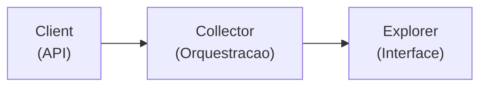

# Modulo IBGE (Instituto Brasileiro de Geografia e Estatistica)

Documentacao do coletor de dados do IBGE via Sistema SIDRA.

## Visao Geral

O modulo `src/adb/ibge/` contem o submodulo SIDRA para acesso a series temporais do IBGE.

| Submodulo | Fonte | Descricao |
|-----------|-------|-----------|
| `sidra/` | API SIDRA v3 | Series temporais (IPCA, PIB, PIM, PMC, PMS, PNAD) |

**Por que usar IBGE/SIDRA?**
- Fonte oficial de dados macroeconomicos brasileiros
- Indicadores de inflacao (IPCA), atividade (PIB, PIM, PMC, PMS) e emprego (PNAD)
- Variacoes ja calculadas (MoM, YoY, acumulado 12m, YTD)
- Dados dessazonalizados disponiveis

---

## Uso Basico

O projeto usa uma arquitetura centralizada baseada em **Explorers**. O acesso padrao e feito via `adb`:

### Coleta de Dados

```python
import adb

# Sidra - Series temporais
adb.sidra.collect()                          # Todos indicadores
adb.sidra.collect('ipca')                    # Um indicador
adb.sidra.collect(['ipca', 'pib'])           # Lista
```

### Leitura de Dados

```python
import adb

# Sidra Explorer
df = adb.sidra.read('ipca')                  # Leitura simples
df = adb.sidra.read('ipca', start='2020')    # Com filtro de data
df = adb.sidra.read('ipca', 'ipca_12m')      # Multiplos indicadores
print(adb.sidra.available())                 # Lista indicadores disponiveis
print(adb.sidra.info('ipca'))                # Info do indicador
```

---

## SIDRA (Sistema IBGE de Recuperacao Automatica)

### Indicadores Disponiveis

Configurados em `src/adb/ibge/sidra/indicators.py`:

**IPCA (Inflacao) - Mensal:**

| Chave | Tabela | Variavel | Descricao |
|-------|--------|----------|-----------|
| `ipca` | 1737 | 63 | IPCA - Variacao mensal |
| `ipca_3m` | 1737 | 2263 | IPCA - Variacao acumulada 3 meses |
| `ipca_6m` | 1737 | 2264 | IPCA - Variacao acumulada 6 meses |
| `ipca_ytd` | 1737 | 69 | IPCA - Variacao acumulada no ano |
| `ipca_12m` | 1737 | 2265 | IPCA - Variacao acumulada 12 meses |
| `ipca_indice` | 1737 | 2266 | IPCA - Numero-indice (base dez/1993=100) |
| `ipca_grupos` | 7060 | 63 | IPCA - Variacao mensal por grupos |

**PIB (Atividade) - Trimestral:**

| Chave | Tabela | Variavel | Descricao |
|-------|--------|----------|-----------|
| `pib` | 1620 | 583 | PIB Trimestral - Serie encadeada |
| `pib_dessaz` | 1621 | 584 | PIB Trimestral - Dessazonalizado |
| `pib_yoy` | 5932 | 6561 | PIB - Taxa YoY (trim/trim ano anterior) |
| `pib_qoq` | 5932 | 6564 | PIB - Taxa QoQ (trim/trim anterior dessaz) |
| `pib_ytd` | 5932 | 6563 | PIB - Taxa acumulada no ano |
| `pib_4q` | 5932 | 6562 | PIB - Taxa acumulada 4 trimestres |

**PIM (Producao Industrial) - Mensal:**

| Chave | Tabela | Variavel | Descricao |
|-------|--------|----------|-----------|
| `pim` | 8888 | 12606 | PIM - Industria geral (numero-indice) |
| `pim_dessaz` | 8888 | 12607 | PIM - Dessazonalizado |
| `pim_mom` | 8888 | 11601 | PIM - Variacao m/m-1 (dessaz) |
| `pim_yoy` | 8888 | 11602 | PIM - Variacao m/m-12 |
| `pim_ytd` | 8888 | 11603 | PIM - Variacao acumulada no ano |
| `pim_12m` | 8888 | 11604 | PIM - Variacao acumulada 12 meses |

**PMC (Comercio Varejista) - Mensal:**

| Chave | Tabela | Variavel | Descricao |
|-------|--------|----------|-----------|
| `pmc_varejo` | 8880 | 7169 | PMC - Varejo (volume de vendas) |
| `pmc_varejo_dessaz` | 8880 | 7170 | PMC - Varejo dessazonalizado |
| `pmc_varejo_mom` | 8880 | 11708 | PMC - Varejo MoM (dessaz) |
| `pmc_varejo_yoy` | 8880 | 11709 | PMC - Varejo YoY |
| `pmc_varejo_ytd` | 8880 | 11710 | PMC - Varejo YTD |
| `pmc_varejo_12m` | 8880 | 11711 | PMC - Varejo acumulado 12 meses |
| `pmc_ampliado` | 8881 | 7169 | PMC - Ampliado (volume de vendas) |
| `pmc_ampliado_dessaz` | 8881 | 7170 | PMC - Ampliado dessazonalizado |
| `pmc_ampliado_mom` | 8881 | 11708 | PMC - Ampliado MoM (dessaz) |
| `pmc_ampliado_yoy` | 8881 | 11709 | PMC - Ampliado YoY |
| `pmc_ampliado_ytd` | 8881 | 11710 | PMC - Ampliado YTD |
| `pmc_ampliado_12m` | 8881 | 11711 | PMC - Ampliado acumulado 12 meses |

**PMS (Servicos) - Mensal:**

| Chave | Tabela | Variavel | Descricao |
|-------|--------|----------|-----------|
| `pms` | 5906 | 7167 | PMS - Volume de servicos |
| `pms_dessaz` | 5906 | 7168 | PMS - Dessazonalizado |
| `pms_mom` | 5906 | 11623 | PMS - MoM (dessaz) |
| `pms_yoy` | 5906 | 11624 | PMS - YoY |
| `pms_ytd` | 5906 | 11625 | PMS - YTD |
| `pms_12m` | 5906 | 11626 | PMS - Acumulado 12 meses |

**PNAD (Emprego) - Trimestral:**

| Chave | Tabela | Variavel | Descricao |
|-------|--------|----------|-----------|
| `pnad_desocupacao` | 4099 | 4099 | Taxa de desocupacao - PNAD Continua |

### Funcoes Auxiliares

```python
import adb

adb.sidra.available()                         # Lista todas as chaves
adb.sidra.info('ipca')                        # Config do indicador
adb.sidra.available(frequency='monthly')      # Filtra por frequencia
```

---

## Uso Avancado (Acesso Direto)

Para casos especiais onde e necessario acesso direto aos collectors/clients:

### Collectors

```python
from adb.ibge.sidra.collector import SidraCollector

collector = SidraCollector()
collector.collect('ipca')
collector.get_status()
```

### Clients (Baixo Nivel)

```python
from adb.ibge.sidra.client import SidraClient

client = SidraClient()

# Busca dados usando config do indicador
config = {
    'agregados': '1737',
    'periodos': 'all',
    'variaveis': '63',
    'nivel_territorial': '1',
    'localidades': 'all',
}
df = client.get_data(config=config, start_date='2020-01-01')
```

### Assinaturas dos Metodos Principais

**SidraClient.get_data():**
```python
def get_data(
    config: dict,
    start_date: str = None,
    verbose: bool = False,
) -> pd.DataFrame
```

**SidraCollector.collect():**
```python
def collect(
    indicators: list[str] | str = 'all',
    save: bool = True,
    verbose: bool = True,
) -> None
```

---

## API Publica

```python
import adb

adb.sidra.collect()                          # Coleta todos indicadores
adb.sidra.collect('ipca')                    # Coleta um indicador
adb.sidra.read('ipca')                       # Le dados
adb.sidra.read('ipca', start='2020')         # Com filtro de data
adb.sidra.available()                        # Lista indicadores
adb.sidra.info('ipca')                       # Detalhes do indicador
adb.sidra.get_status()                       # Status dos arquivos
```

---

## Arquivos Gerados

```
data/
└── raw/
    └── ibge/
        └── sidra/
            ├── monthly/      # IPCA, PIM, PMC, PMS
            │   ├── ipca.parquet
            │   ├── ipca_12m.parquet
            │   ├── pim.parquet
            │   ├── pmc_varejo.parquet
            │   └── pms.parquet
            └── quarterly/    # PIB, PNAD
                ├── pib.parquet
                ├── pib_dessaz.parquet
                └── pnad_desocupacao.parquet
```

---

## Extensibilidade

Para adicionar novos indicadores IBGE Sidra:

```python
# Em src/adb/ibge/sidra/indicators.py
SIDRA_CONFIG['novo_indicador'] = {
    'code': 1234,                    # Numero da tabela SIDRA
    'name': 'Nome Legivel',
    'frequency': 'monthly',          # monthly ou quarterly
    'parameters': {
        'agregados': '1234',         # Tabela
        'periodos': 'all',
        'variaveis': '5678',         # Variavel da tabela
        'nivel_territorial': '1',    # 1 = Brasil
        'localidades': 'all',
        'classification': '315[all]' # Opcional: filtro de classificacao
    },
    'description': 'Descricao do indicador',
}
```

**Descobrindo tabelas e variaveis SIDRA:**
- Acesse https://sidra.ibge.gov.br
- Navegue ate a tabela desejada
- Anote o numero da tabela (ex: 1737) e variaveis disponiveis
- Use a documentacao da API: https://servicodados.ibge.gov.br/api/docs/agregados

---

## Arquitetura Interna

O modulo segue a arquitetura de tres camadas:



| Camada | Classe |
|--------|--------|
| Client | `SidraClient` |
| Collector | `SidraCollector(BaseCollector)` |
| Explorer | `SidraExplorer(BaseExplorer)` |
| Config | `SIDRA_CONFIG` (42 indicadores) |

Veja [architecture.md](architecture.md) para detalhes sobre `BaseCollector` e `BaseExplorer`.

---

## Notas Tecnicas

### Tratamento de Datas

- **Mensal:** Datas normalizadas para fim do mes (ex: 2024-01-31)
- **Trimestral:** Datas normalizadas para fim do trimestre (ex: 2024-03-31 para Q1)

### Formato da API SIDRA

O client usa a API v3 do SIDRA:
- URL base: `https://servicodados.ibge.gov.br/api/v3/agregados/`
- Periodos: formato `AAAAMM` (mensal) ou `AAAA0T` (trimestral)
- Resposta: JSON com estrutura `data[0].resultados[0].series[0].serie`

### Resiliencia

O `SidraClient` usa o decorator `@retry` para lidar com instabilidades de rede:
- 3 tentativas com exponential backoff
- Jitter aleatorio para evitar thundering herd
