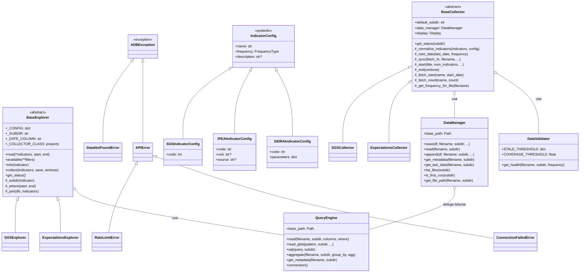
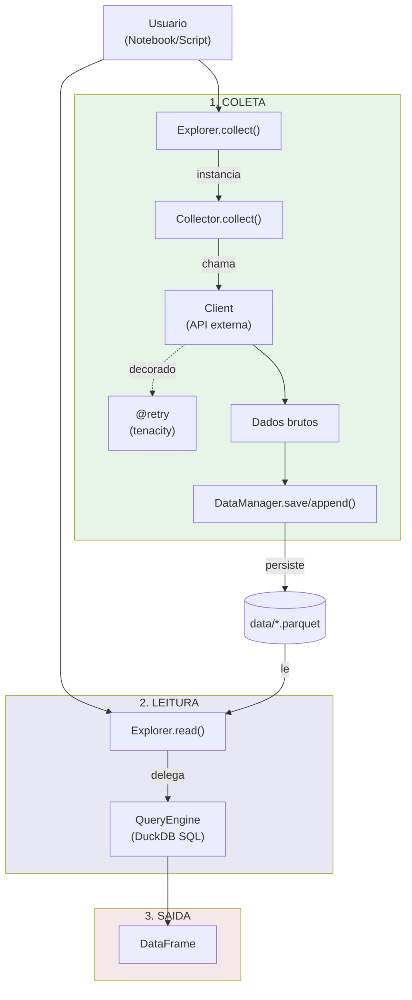
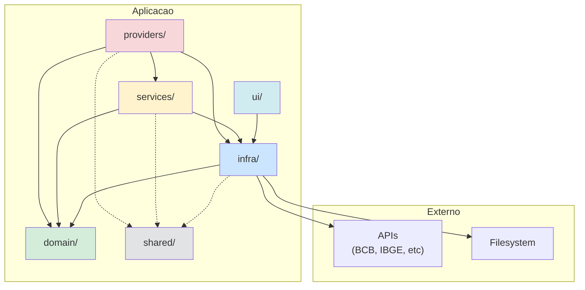

# Arquitetura do Projeto

Documentacao tecnica da arquitetura Clean Architecture usada no `adb`.

---

## Visao Geral

O projeto segue **Clean Architecture** com cinco camadas principais, organizadas por responsabilidade:

| Camada | Diretorio | Responsabilidade |
|--------|-----------|------------------|
| **Domain** | `domain/` | Regras de negocio, entidades, excecoes, schemas Pydantic |
| **Infra** | `infra/` | I/O, configuracoes, logging, retry, persistencia |
| **Services** | `services/` | Logica de aplicacao, BaseCollector, registry |
| **Providers** | `providers/` | Implementacoes especificas por fonte de dados |
| **Shared** | `shared/` | Utilitarios compartilhados (datas, indicadores) |
| **UI** | `ui/` | Output visual ao usuario (Rich) |

### Principios

1. **Dependencias apontam para dentro**: Providers dependem de Services, Services dependem de Domain
2. **Domain e puro**: Sem dependencias externas (exceto Pydantic para validacao)
3. **Infra e o adaptador**: Conecta o sistema ao mundo externo (APIs, filesystem, logs)
4. **Inversao de dependencia**: Interfaces definidas em Domain, implementacoes em Infra

---

## Estrutura de Pastas

```
src/adb/
├── __init__.py              # Exports publicos (explorers, config)
│
├── domain/                  # CAMADA DE DOMINIO
│   ├── __init__.py          # Exports (BaseExplorer, exceptions, schemas)
│   ├── exceptions.py        # ADBException, DataNotFoundError, APIError, etc.
│   ├── explorers.py         # BaseExplorer (interface unificada de leitura)
│   └── schemas/             # Validacao Pydantic
│       ├── __init__.py
│       └── indicators.py    # IndicatorConfig, SGSIndicatorConfig, etc.
│
├── infra/                   # CAMADA DE INFRAESTRUTURA
│   ├── __init__.py          # Exports (get_settings, get_logger, retry)
│   ├── config.py            # Settings (platformdirs) e constantes de resiliencia
│   ├── log.py               # Sistema de logging (loguru)
│   ├── resilience.py        # Decorator @retry (tenacity)
│   └── persistence/         # Subcamada de persistencia
│       ├── __init__.py      # Exports (DataManager, QueryEngine)
│       ├── storage.py       # DataManager (I/O Parquet)
│       ├── query.py         # QueryEngine (DuckDB)
│       └── validation.py    # DataValidator (integridade)
│
├── services/                # CAMADA DE SERVICOS
│   ├── __init__.py
│   └── collectors/          # Abstracao de coleta
│       ├── __init__.py
│       ├── base.py          # BaseCollector
│       └── registry.py      # Mapeamento de collectors
│
├── providers/               # CAMADA DE PROVIDERS (por fonte)
│   ├── bacen/               # Banco Central
│   │   ├── sgs/             # client, collector, explorer, indicators
│   │   └── expectations/    # client, collector, explorer, indicators
│   ├── ibge/
│   │   └── sidra/           # client, collector, explorer, indicators
│   ├── ipea/                # client, collector, explorer, indicators
│   └── bloomberg/           # client, collector, explorer, indicators
│
├── shared/                  # UTILITARIOS COMPARTILHADOS
│   └── utils/
│       ├── dates.py         # parse_date, normalize_index
│       └── indicators.py    # list_keys, get_config
│
└── ui/                      # INTERFACE DE USUARIO
    ├── __init__.py
    └── display.py           # Output visual (Rich)
```

---

## Hierarquia de Classes

Diagrama mostrando heranca e composicao entre componentes:



---

## Fluxo de Dados

Diagrama do fluxo completo desde coleta ate visualizacao:



### Detalhes do Fluxo

#### 1. Coleta

```python
import adb

# Usuario chama collect no Explorer
adb.sgs.collect(['selic', 'cdi'])

# Internamente:
# 1. Explorer instancia Collector
# 2. Collector usa _sync() para orquestrar
# 3. Client faz requisicao (com @retry)
# 4. DataManager salva em Parquet
```

#### 2. Leitura

```python
# Usuario chama read no Explorer
df = adb.sgs.read('selic', start='2023')

# Internamente:
# 1. Explorer constroi WHERE clause
# 2. QueryEngine executa SQL no DuckDB
# 3. Retorna DataFrame com DatetimeIndex
```

---

## Padroes de Projeto

| Padrao | Onde | Descricao |
|--------|------|-----------|
| **Template Method** | `BaseCollector._sync()` | Define esqueleto do algoritmo; subclasses implementam `fetch_fn` |
| **Facade** | `BaseExplorer` | Simplifica acesso a Collector + QueryEngine |
| **Strategy** | `StorageCallback` | Callback protocol para feedback de storage |
| **Lazy Loading** | `__init__.py` | Explorers carregados sob demanda |
| **Decorator** | `@retry` | Resiliencia de rede via tenacity |
| **Singleton** | `get_display()` | Instancia unica de Display (thread-safe) |
| **Composition** | `DataManager -> QueryEngine` | DataManager delega leituras para QueryEngine |

---

## Dependencias entre Camadas



**Regra de Ouro**: Domain nunca depende de outras camadas internas.

---

## Documentacao Relacionada

| Doc | Conteudo |
|-----|----------|
| [domain.md](domain.md) | BaseExplorer, Schemas, Exceptions |
| [infra.md](infra.md) | Config, Log, Resilience, Persistence |
| [services.md](services.md) | BaseCollector, Registry |
