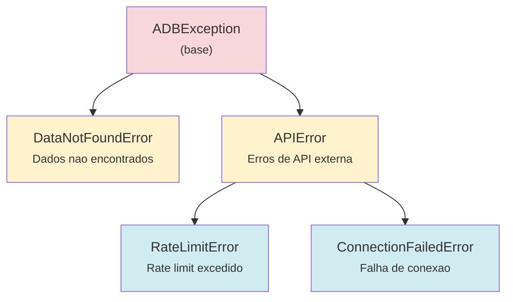

# Camada de Dominio

Documentacao da camada `domain/` - regras de negocio, entidades e validacao.

---

## Visao Geral

A camada de dominio contem:

| Modulo | Arquivo | Responsabilidade |
|--------|---------|------------------|
| **BaseExplorer** | `explorers.py` | Interface unificada para leitura e coleta |
| **Exceptions** | `exceptions.py` | Hierarquia de excecoes customizadas |
| **Schemas** | `schemas/indicators.py` | Validacao Pydantic de configuracoes |

```
domain/
├── __init__.py        # Exports publicos
├── exceptions.py      # ADBException, DataNotFoundError, etc.
├── explorers.py       # BaseExplorer
└── schemas/
    ├── __init__.py
    └── indicators.py  # IndicatorConfig, SGSIndicatorConfig, etc.
```

---

## BaseExplorer

**Localizacao:** `src/adb/domain/explorers.py`

Classe base abstrata que define a interface publica para leitura e coleta de dados. Todos os explorers especificos (SGSExplorer, CAGEDExplorer, etc.) herdam desta classe.

### Atributos de Classe

Subclasses **devem** definir:

| Atributo | Tipo | Descricao |
|----------|------|-----------|
| `_CONFIG` | `dict` | Dicionario de configuracao de indicadores |
| `_SUBDIR` | `str` | Subdiretorio padrao para arquivos Parquet |
| `_COLLECTOR_CLASS` | `property` | Retorna classe do collector (lazy import) |

Subclasses **podem** sobrescrever:

| Atributo | Tipo | Default | Descricao |
|----------|------|---------|-----------|
| `_DATE_COLUMN` | `str` | `'date'` | Nome da coluna de data |

### Metodos Publicos

#### `__init__(self, query_engine=None)`

Inicializa o explorer.

```python
from adb.providers.bacen.sgs.explorer import SGSExplorer

# Usa QueryEngine padrao
explorer = SGSExplorer()

# Ou com QueryEngine customizado
from adb.infra.persistence import QueryEngine
qe = QueryEngine(base_path=Path('/custom/path'))
explorer = SGSExplorer(query_engine=qe)
```

---

#### `read(*indicators, start=None, end=None, columns=None) -> DataFrame`

Le series temporais do armazenamento.

| Parametro | Tipo | Descricao |
|-----------|------|-----------|
| `*indicators` | `str` | Nomes dos indicadores (vazio = todos) |
| `start` | `str` | Data inicial ('2020', '2020-01', '2020-01-15') |
| `end` | `str` | Data final |
| `columns` | `list[str]` | Colunas especificas (default: todas) |

**Retorno:** DataFrame com DatetimeIndex

**Comportamento:**
- Um indicador: retorna DataFrame direto com todas as colunas
- Multiplos indicadores: join por data, coluna `value` renomeada para nome do indicador

```python
import adb

# Um indicador - todas as colunas
df = adb.sgs.read('selic', start='2023')
# DataFrame com colunas: date (index), value

# Multiplos indicadores - join automatico
df = adb.sgs.read('selic', 'cdi', start='2023')
# DataFrame com colunas: date (index), selic, cdi
```

**Raises:** `KeyError` se indicador nao encontrado

---

#### `available(**filters) -> list[str]`

Lista indicadores disponiveis, opcionalmente filtrados.

| Parametro | Tipo | Descricao |
|-----------|------|-----------|
| `**filters` | kwargs | Filtros por atributo do config |

```python
import adb

# Todos os indicadores
adb.sgs.available()
# ['selic', 'cdi', 'dolar_ptax', 'ipca', ...]

# Filtrado por frequencia
adb.sgs.available(frequency='daily')
# ['selic', 'cdi', 'dolar_ptax']

adb.sgs.available(frequency='monthly')
# ['ipca', 'ibc_br_bruto', ...]
```

---

#### `info(indicator=None) -> dict`

Retorna informacoes sobre indicador(es).

| Parametro | Tipo | Descricao |
|-----------|------|-----------|
| `indicator` | `str` | Nome do indicador (None = todos) |

```python
import adb

# Um indicador
adb.sgs.info('selic')
# {'code': 432, 'name': 'Meta Selic', 'frequency': 'daily', ...}

# Todos
adb.sgs.info()
# {'selic': {...}, 'cdi': {...}, ...}
```

**Raises:** `KeyError` se indicador especifico nao encontrado

---

#### `collect(indicators='all', save=True, verbose=True, **kwargs)`

Coleta dados da fonte externa.

| Parametro | Tipo | Default | Descricao |
|-----------|------|---------|-----------|
| `indicators` | `str \| list[str]` | `'all'` | Indicadores a coletar |
| `save` | `bool` | `True` | Se True, persiste em Parquet |
| `verbose` | `bool` | `True` | Se True, exibe progresso |
| `**kwargs` | kwargs | - | Argumentos extras para o collector |

```python
import adb

# Todos os indicadores
adb.sgs.collect()

# Indicador unico
adb.sgs.collect('selic')

# Lista de indicadores
adb.sgs.collect(['selic', 'cdi'])
```

---

#### `get_status() -> DataFrame`

Retorna status dos arquivos salvos.

```python
import adb

adb.sgs.get_status()
# DataFrame com colunas:
# - arquivo: nome do indicador
# - registros: numero de linhas
# - primeira_data, ultima_data
# - cobertura: percentual (0-100)
# - gaps: numero de lacunas
# - status: 'OK', 'STALE', 'GAPS', 'MISSING'
```

---

### Metodos Protegidos (Extension Points)

Para customizar comportamento em subclasses:

| Metodo | Descricao |
|--------|-----------|
| `_subdir(indicator)` | Retorna subdir dinamico por indicador |
| `_where(start, end)` | Constroi clausula WHERE para filtro |
| `_join(dfs, indicators)` | Logica de join de multiplos DataFrames |

```python
class SGSExplorer(BaseExplorer):
    def _subdir(self, indicator: str) -> str:
        """SGS usa subdir por frequencia."""
        freq = self._CONFIG[indicator].get('frequency', 'daily')
        return f'bacen/sgs/{freq}'
```

---

## Schemas Pydantic

**Localizacao:** `src/adb/domain/schemas/indicators.py`

Sistema de validacao de configuracoes usando Pydantic. Garante que configuracoes de indicadores estejam corretas antes de requisicoes a APIs.

### FrequencyType

Tipo literal para frequencias suportadas:

```python
FrequencyType = Literal["daily", "monthly", "quarterly", "yearly"]
```

---

### IndicatorConfig

Schema base para todos os tipos de indicadores.

| Campo | Tipo | Obrigatorio | Descricao |
|-------|------|-------------|-----------|
| `name` | `str` | Sim | Nome do indicador (min 1 char) |
| `frequency` | `FrequencyType` | Sim | Frequencia dos dados |
| `description` | `str \| None` | Nao | Descricao do indicador |

**Configuracao:**
- `model_config = {"extra": "allow"}` - Permite campos extras para extensibilidade

```python
from adb.domain.schemas import IndicatorConfig

config = IndicatorConfig(
    name="Taxa Selic",
    frequency="daily",
    description="Meta da taxa Selic"
)
```

---

### SGSIndicatorConfig

Schema para indicadores do Sistema Gerenciador de Series (BCB).

| Campo | Tipo | Validacao | Descricao |
|-------|------|-----------|-----------|
| `code` | `int` | `> 0` | Codigo numerico da serie SGS |

Herda todos os campos de `IndicatorConfig`.

```python
from adb.domain.schemas import SGSIndicatorConfig

config = SGSIndicatorConfig(
    name="Taxa Selic",
    code=432,
    frequency="daily"
)

# Erro se codigo invalido
try:
    invalid = SGSIndicatorConfig(name="Test", code=-1, frequency="daily")
except ValueError as e:
    print(e)  # code > 0
```

---

### IPEAIndicatorConfig

Schema para indicadores do IPEA Data.

| Campo | Tipo | Validacao | Descricao |
|-------|------|-----------|-----------|
| `code` | `str` | Nao vazio | Codigo string da serie |
| `unit` | `str \| None` | - | Unidade de medida |
| `source` | `str \| None` | - | Fonte dos dados |

```python
from adb.domain.schemas import IPEAIndicatorConfig

config = IPEAIndicatorConfig(
    name="Emprego Formal",
    code="CAGED12_SALam12",
    frequency="monthly",
    unit="pessoas",
    source="MTE/CAGED"
)
```

**Validador customizado:**
```python
@field_validator("code")
@classmethod
def validate_ipea_code(cls, v: str) -> str:
    """Valida que codigo IPEA nao esta vazio."""
    if not v.strip():
        raise ValueError("Codigo IPEA nao pode estar vazio")
    return v.strip()
```

---

### SIDRAIndicatorConfig

Schema para indicadores SIDRA (IBGE).

| Campo | Tipo | Validacao | Descricao |
|-------|------|-----------|-----------|
| `code` | `int` | `> 0` | Codigo da tabela SIDRA |
| `parameters` | `dict` | Campos obrigatorios | Parametros da consulta |

**Campos obrigatorios em `parameters`:**
- `agregados`
- `periodos`
- `variaveis`
- `nivel_territorial`
- `localidades`

```python
from adb.domain.schemas import SIDRAIndicatorConfig

config = SIDRAIndicatorConfig(
    name="IPCA",
    code=1737,
    frequency="monthly",
    parameters={
        "agregados": [1, 2],
        "periodos": "all",
        "variaveis": 63,
        "nivel_territorial": "N1",
        "localidades": "all"
    }
)
```

---

### validate_indicator_config()

Valida um dicionario completo de configuracoes.

```python
def validate_indicator_config(
    config: dict[str, dict],
    schema_class: type[IndicatorConfig],
) -> dict[str, IndicatorConfig]
```

| Parametro | Tipo | Descricao |
|-----------|------|-----------|
| `config` | `dict[str, dict]` | Dicionario {chave: config_dict} |
| `schema_class` | `type[IndicatorConfig]` | Classe do schema a usar |

**Retorno:** `dict[str, IndicatorConfig]` com schemas validados

**Raises:** `ValueError` indicando qual key falhou

```python
from adb.domain.schemas import validate_indicator_config, SGSIndicatorConfig

# Config dict (como definido em indicators.py)
SGS_CONFIG = {
    'selic': {'name': 'Meta Selic', 'code': 432, 'frequency': 'daily'},
    'cdi': {'name': 'CDI', 'code': 12, 'frequency': 'daily'},
}

# Validar todas as configs
validated = validate_indicator_config(SGS_CONFIG, SGSIndicatorConfig)

# Acessar campos validados
print(validated['selic'].code)       # 432
print(validated['selic'].frequency)  # 'daily'
```

---

## Exceptions

**Localizacao:** `src/adb/domain/exceptions.py`

Hierarquia de excecoes customizadas para o pacote.

### Hierarquia



### Classes

#### ADBException

Excecao base para o pacote. Todas as excecoes customizadas herdam desta.

```python
class ADBException(Exception):
    """Excecao base para o pacote adb."""
    pass
```

---

#### DataNotFoundError

Dados solicitados nao existem ou nao foram encontrados.

```python
from adb.domain.exceptions import DataNotFoundError

try:
    df = explorer.read('indicador_inexistente')
except DataNotFoundError as e:
    print(f"Dados nao encontrados: {e}")
```

---

#### APIError

Erro retornado por API externa.

```python
from adb.domain.exceptions import APIError

try:
    data = client.fetch(code=12345)
except APIError as e:
    print(f"Erro na API: {e}")
```

---

#### RateLimitError

Limite de requisicoes excedido pela API. Herda de `APIError`.

```python
from adb.domain.exceptions import RateLimitError

try:
    # Muitas requisicoes
    for i in range(1000):
        client.fetch(code=i)
except RateLimitError:
    print("Rate limit atingido, aguarde...")
```

---

#### ConnectionFailedError

Falha de conexao com servico externo. Herda de `APIError`.

```python
from adb.domain.exceptions import ConnectionFailedError

try:
    client.fetch(code=432)
except ConnectionFailedError:
    print("Falha de conexao - verifique sua rede")
```

---

## Uso Geral

### Imports Recomendados

```python
# API publica (para usuarios)
import adb
df = adb.sgs.read('selic')

# Imports diretos (para desenvolvedores)
from adb.domain import BaseExplorer, ADBException
from adb.domain.schemas import SGSIndicatorConfig, validate_indicator_config
from adb.domain.exceptions import DataNotFoundError, APIError
```

### Exemplo: Criar Novo Explorer

```python
from adb.domain import BaseExplorer
from adb.domain.schemas import SGSIndicatorConfig, validate_indicator_config

# 1. Definir configuracao
MY_CONFIG = {
    'indicador1': {'name': 'Meu Indicador', 'code': 123, 'frequency': 'daily'},
}

# 2. Validar (opcional mas recomendado)
validated = validate_indicator_config(MY_CONFIG, SGSIndicatorConfig)

# 3. Criar explorer
class MyExplorer(BaseExplorer):
    _CONFIG = MY_CONFIG
    _SUBDIR = 'minha_fonte/daily'

    @property
    def _COLLECTOR_CLASS(self):
        from minha_fonte.collector import MyCollector
        return MyCollector
```

---

## Documentacao Relacionada

| Doc | Conteudo |
|-----|----------|
| [architecture.md](architecture.md) | Visao geral da arquitetura |
| [infra.md](infra.md) | Config, Log, Resilience, Persistence |
| [services.md](services.md) | BaseCollector, Registry |
