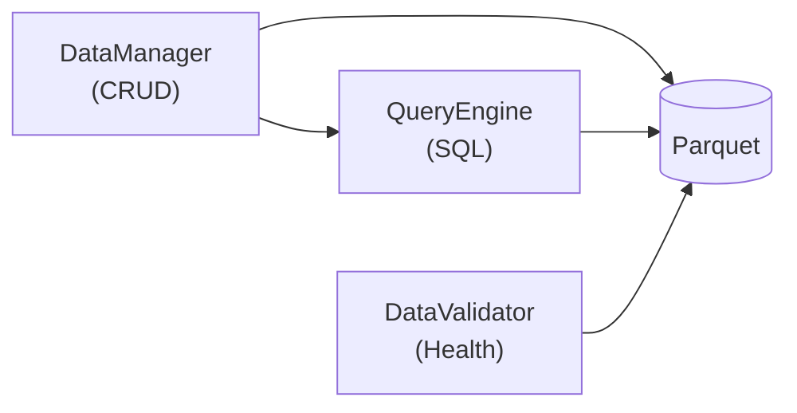

# Camada de Infraestrutura

Documentacao da camada `infra/` - I/O, configuracoes, logging e persistencia.

---

## Visao Geral

A camada de infraestrutura fornece:

| Modulo | Arquivo | Responsabilidade |
|--------|---------|------------------|
| **Config** | `config.py` | Settings (platformdirs) e constantes de resiliencia |
| **Log** | `log.py` | Sistema de logging (loguru) |
| **Resilience** | `resilience.py` | Decorator @retry (tenacity) |
| **Persistence** | `persistence/` | DataManager, QueryEngine, DataValidator |

```
infra/
├── __init__.py         # Exports publicos
├── config.py           # Settings (platformdirs)
├── log.py              # Sistema de logging
├── resilience.py       # Retry com backoff
└── persistence/
    ├── __init__.py     # Exports (DataManager, QueryEngine)
    ├── storage.py      # DataManager (I/O Parquet)
    ├── query.py        # QueryEngine (DuckDB)
    └── validation.py   # DataValidator (integridade)
```

---

## config.py

**Localizacao:** `src/adb/infra/config.py`

Configuracao centralizada usando `platformdirs` para paths e `pydantic-settings` para override via env vars.

### Settings

| Propriedade | Descricao |
|-------------|-----------|
| `data_dir` | Diretorio de cache (default: `user_cache_dir("py-adb")`) |
| `logs_path` | Diretorio de logs (`{data_dir}/../Logs`) |

**Override via variavel de ambiente:** `ADB_DATA_DIR`

### Constantes de Resiliencia

| Constante | Valor | Descricao |
|-----------|-------|-----------|
| `DEFAULT_REQUEST_TIMEOUT` | `30` | Timeout HTTP em segundos |
| `DEFAULT_RETRY_ATTEMPTS` | `3` | Tentativas maximas |
| `DEFAULT_RETRY_DELAY` | `1.0` | Delay inicial em segundos |
| `DEFAULT_BACKOFF_FACTOR` | `2.0` | Multiplicador de backoff |
| `DEFAULT_CHUNK_DELAY` | `2.0` | Delay entre chunks de requisicoes |

### Uso

```python
from adb.infra.config import get_settings

settings = get_settings()
print(settings.data_dir)  # %LOCALAPPDATA%/py-adb/Cache (Windows)
print(settings.logs_path)  # %LOCALAPPDATA%/py-adb/Logs
```

---

## log.py

**Localizacao:** `src/adb/infra/log.py`

Sistema de logging tecnico centralizado usando **loguru**. Registra informacoes detalhadas apenas em arquivo para debugging e auditoria.

### Caracteristicas

- **Arquivo:** DEBUG+, rotacao 10MB, retencao 30 dias
- **Path:** `{data_dir}/../Logs/adb_YYYY-MM-DD.log`
- **Formato:** `[YYYY-MM-DD HH:MM:SS] LEVEL [logger_name] message`
- **Lazy initialization:** Configura apenas na primeira chamada
- **Sem console:** Output visual via `Display` (ver `ui/display.py`)

### get_logger(name)

Cria ou retorna logger configurado com contexto.

| Parametro | Tipo | Descricao |
|-----------|------|-----------|
| `name` | `str` | Nome do logger (geralmente `__name__`) |

**Retorno:** Logger loguru com contexto do modulo (`logger.bind(name=name)`)

```python
from adb.infra.log import get_logger

logger = get_logger(__name__)
logger.info("Registro tecnico para arquivo")
logger.debug("Detalhes de debugging")
logger.warning("Aviso importante")
logger.error("Erro ocorrido")
```

### Configuracao Interna

```python
def _ensure_configured():
    """Configura logging na primeira necessidade (lazy)."""
    global _configured, _logger_instance

    if _configured:
        return

    from datetime import datetime
    from loguru import logger
    from adb.infra.config import get_settings

    logs_path = get_settings().logs_path

    logger.remove()

    today = datetime.now().strftime('%Y-%m-%d')
    log_file = logs_path / f"adb_{today}.log"

    logger.add(
        log_file,
        format="[{time:YYYY-MM-DD HH:mm:ss}] {level} [{name}] {message}",
        level="DEBUG",
        rotation="10 MB",
        retention="30 days",
        encoding="utf-8",
    )

    _logger_instance = logger
    _configured = True
```

---

## resilience.py

**Localizacao:** `src/adb/infra/resilience.py`

Decorator para retry automatico com backoff exponencial usando **tenacity**.

### TRANSIENT_EXCEPTIONS

Tupla de excecoes que justificam retry automatico:

```python
TRANSIENT_EXCEPTIONS = (
    # HTTP (httpx)
    httpx.HTTPError,
    # Rede/OS
    ConnectionError,
    TimeoutError,
    OSError,  # Inclui socket errors + requests exceptions (via ipeadatapy)

    # Parsing (APIs que retornam resposta invalida/vazia)
    json.JSONDecodeError,
    ValueError,
)
```

### @retry()

Decorator para retry com exponential backoff e jitter.

| Parametro | Tipo | Default | Descricao |
|-----------|------|---------|-----------|
| `max_attempts` | `int` | `3` | Numero maximo de tentativas |
| `delay` | `float` | `1.0` | Delay inicial em segundos |
| `backoff_factor` | `float` | `2.0` | Multiplicador do delay |
| `exceptions` | `tuple` | `TRANSIENT_EXCEPTIONS` | Excecoes que disparam retry |
| `jitter` | `bool` | `True` | Adiciona variacao aleatoria ao delay |

**Comportamento:**
- Com `jitter=True`: usa `wait_random_exponential` (evita thundering herd)
- Com `jitter=False`: usa `wait_exponential` para delays fixos
- Logs de retry via callbacks integrados com loguru

```python
from adb.infra.resilience import retry

@retry(max_attempts=3, delay=1.0)
def fetch_data(url):
    return httpx.get(url, timeout=30)

# Com parametros customizados
@retry(max_attempts=5, delay=2.0, jitter=False)
def fetch_critical(url):
    return httpx.get(url, timeout=60)
```

### Callbacks de Log

```python
def _before_sleep_log(retry_state: RetryCallState):
    """Loga antes de dormir entre tentativas."""
    _get_logger().warning(
        f"Tentativa {retry_state.attempt_number} falhou para {retry_state.fn.__name__}. "
        f"Retry em {retry_state.upcoming_sleep:.1f}s. Erro: {exception}"
    )

def _log_final_failure(retry_state: RetryCallState):
    """Loga quando todas tentativas falharam."""
    _get_logger().error(
        f"Funcao {retry_state.fn.__name__} falhou apos "
        f"{retry_state.attempt_number} tentativas. Erro: {exception}"
    )
```

---

## persistence/

Subcamada de persistencia de dados.

### Arquitetura



---

## DataManager

**Localizacao:** `src/adb/infra/persistence/storage.py`

Gerenciador de persistencia em Parquet para indicadores economicos.

### Inicializacao

```python
class DataManager:
    def __init__(
        self,
        base_path: Path = None,
        callback: StorageCallback = None,
    ):
```

| Parametro | Tipo | Default | Descricao |
|-----------|------|---------|-----------|
| `base_path` | `Path` | `get_settings().data_dir` | Caminho base para data/ |
| `callback` | `StorageCallback` | `NullCallback()` | Callback para feedback |

### Metodos CRUD

#### save()

Salva DataFrame em arquivo Parquet.

```python
def save(
    self,
    df: pd.DataFrame,
    filename: str,
    subdir: str = 'daily',
    metadata: dict = None,
    verbose: bool = False,
)
```

| Parametro | Descricao |
|-----------|-----------|
| `df` | DataFrame para salvar |
| `filename` | Nome do arquivo (sem extensao) |
| `subdir` | Subdiretorio dentro de data/ |
| `metadata` | Dicionario adicional (opcional) |
| `verbose` | Se True, dispara callback |

Usa DuckDB COPY para escrita (mesmo padrao de pycaged/ifdata-bcb).

```python
dm = DataManager()
dm.save(df, 'selic', subdir='bacen/sgs/daily')
```

---

#### read()

Le arquivo via DuckDB (otimizado).

```python
def read(self, filename: str, subdir: str = 'daily') -> pd.DataFrame
```

```python
dm = DataManager()
df = dm.read('selic', subdir='bacen/sgs/daily')
```

---

#### append()

Adiciona dados a arquivo existente (incremental).

```python
def append(
    self,
    df: pd.DataFrame,
    filename: str,
    subdir: str = 'daily',
    dedup: bool = True,
    verbose: bool = False,
)
```

| Parametro | Descricao |
|-----------|-----------|
| `dedup` | Se True, remove duplicatas por coluna date |

**Implementacao:**
- Usa DuckDB para streaming (nao carrega tudo na RAM)
- Escreve para arquivo temporario
- Faz replace atomico

```python
dm = DataManager()
dm.append(new_data, 'selic', subdir='bacen/sgs/daily', dedup=True)
```

---

### Metodos de Consulta

| Metodo | Assinatura | Descricao |
|--------|------------|-----------|
| `get_metadata` | `(filename, subdir) -> dict` | Metadados do arquivo |
| `get_last_date` | `(filename, subdir) -> datetime` | Ultima data salva |
| `list_files` | `(subdir) -> list[str]` | Lista arquivos no subdir |
| `is_first_run` | `(subdir) -> bool` | Verifica se subdir vazio |
| `get_file_path` | `(filename, subdir) -> Path` | Path completo do arquivo |

---

### StorageCallback

Protocol para feedback de operacoes:

```python
class StorageCallback(Protocol):
    def on_saved(self, path: str) -> None: ...
    def on_appended(self, path: str) -> None: ...
```

Implementacoes:
- `NullCallback`: Silencioso (default)
- `DisplayCallback`: Conecta ao sistema Display (Rich)

---

## QueryEngine

**Localizacao:** `src/adb/infra/persistence/query.py`

Motor de consultas SQL sobre Parquet usando DuckDB.

### Inicializacao

```python
class QueryEngine:
    def __init__(self, base_path: Path = None, progress_bar: bool = False):
```

| Parametro | Default | Descricao |
|-----------|---------|-----------|
| `base_path` | `get_settings().data_dir` | Caminho base |
| `progress_bar` | `False` | Exibe progresso do DuckDB |

### Metodos de Leitura

#### read()

Le arquivo com filtros opcionais.

```python
def read(
    self,
    filename: str,
    subdir: str = 'daily',
    columns: list[str] = None,
    where: str = None,
) -> pd.DataFrame
```

```python
qe = QueryEngine()

# Leitura simples
df = qe.read('selic', subdir='bacen/sgs/daily')

# Com filtros
df = qe.read('selic', subdir='bacen/sgs/daily',
             where="date >= '2023-01-01'")

# Colunas especificas
df = qe.read('selic', subdir='bacen/sgs/daily',
             columns=['date', 'value'])
```

---

#### read_glob()

Le multiplos arquivos via glob pattern.

```python
def read_glob(
    self,
    pattern: str,
    subdir: str = None,
    columns: list[str] = None,
    where: str = None,
) -> pd.DataFrame
```

```python
qe = QueryEngine()

df = qe.read_glob('*.parquet',
                  subdir='bacen/sgs/daily',
                  columns=['date', 'value'])
```

---

#### sql()

Executa SQL arbitrario com substituicao de variaveis.

```python
def sql(self, query: str, subdir: str = None) -> pd.DataFrame
```

**Variaveis disponiveis:**
- `{base}` -> `data/`
- `{subdir}` -> `data/{subdir}`

```python
qe = QueryEngine()

df = qe.sql("""
    SELECT date, value
    FROM '{base}/bacen/sgs/daily/selic.parquet'
    WHERE date >= '2020-01-01'
""")
```

---

#### aggregate()

Executa agregacao otimizada.

```python
def aggregate(
    self,
    filename: str,
    subdir: str,
    group_by: str | list[str],
    agg: dict[str, str],
    where: str = None
) -> pd.DataFrame
```

```python
qe = QueryEngine()

df = qe.aggregate('selic', 'bacen/sgs/daily',
                  group_by='YEAR(date)',
                  agg={'value': 'AVG'})
```

---

### Outros Metodos

| Metodo | Descricao |
|--------|-----------|
| `get_metadata(filename, subdir)` | Metadados otimizados via DuckDB |
| `connection()` | Retorna conexao DuckDB configurada |

---

## DataValidator

**Localizacao:** `src/adb/infra/persistence/validation.py`

Sistema de validacao de integridade usando **cuallee** e **bizdays** (calendario ANBIMA).

### Uso

```python
from adb.infra.persistence.validation import DataValidator, HealthStatus

with DataValidator() as validator:
    health = validator.get_health('selic', 'bacen/sgs/daily', 'daily')
    print(health.status)     # HealthStatus.OK
    print(health.coverage)   # 98.5
    print(health.stale_days) # 2
```

### HealthStatus

Enum representando status de saude:

| Status | Descricao |
|--------|-----------|
| `OK` | Dados completos e atualizados |
| `STALE` | Dados desatualizados (ultima data antiga) |
| `GAPS` | Dados com lacunas (cobertura < 95%) |
| `MISSING` | Arquivo nao existe |

### HealthReport

Dataclass com metricas de saude:

| Campo | Tipo | Descricao |
|-------|------|-----------|
| `status` | `HealthStatus` | Status de saude |
| `first_date` | `date` | Data inicial |
| `last_date` | `date` | Data final |
| `expected_records` | `int` | Registros esperados |
| `actual_records` | `int` | Registros reais |
| `coverage` | `float` | Cobertura percentual (0-100) |
| `gaps` | `list[Gap]` | Lacunas nos dados |
| `stale_days` | `int` | Dias desde ultima atualizacao |
| `cuallee_results` | `dict` | Resultados dos checks cuallee |

### Gap

Dataclass representando uma lacuna:

```python
@dataclass
class Gap:
    start: date
    end: date
    expected_records: int
```

### Limiares de Staleness

| Frequencia | Dias | Descricao |
|------------|------|-----------|
| `daily` | 3 | Dias uteis (ANBIMA) |
| `monthly` | 45 | Dias corridos |
| `quarterly` | 95 | Dias corridos (~3 meses) |

### get_health()

Analisa saude dos dados.

```python
def get_health(
    self,
    filename: str,
    subdir: str,
    frequency: str | Frequency,
) -> HealthReport
```

**Comportamento:**
- Para `daily`: usa calendario ANBIMA para dias uteis
- Para `monthly`: espera primeiro dia de cada mes
- Para `quarterly`: espera primeiro dia de cada trimestre
- Executa checks cuallee: `is_complete` e `is_unique` na coluna date

---

## Imports Recomendados

```python
# Config
from adb.infra.config import get_settings
settings = get_settings()

# Logging
from adb.infra import get_logger
logger = get_logger(__name__)

# Retry
from adb.infra import retry

@retry(max_attempts=3)
def my_function():
    pass

# Persistencia
from adb.infra.persistence import DataManager, QueryEngine

dm = DataManager()
qe = QueryEngine()

# Validacao
from adb.infra.persistence.validation import DataValidator, HealthStatus
```

---

## Documentacao Relacionada

| Doc | Conteudo |
|-----|----------|
| [architecture.md](architecture.md) | Visao geral da arquitetura |
| [domain.md](domain.md) | BaseExplorer, Exceptions |
| [services.md](services.md) | BaseCollector, Registry |
