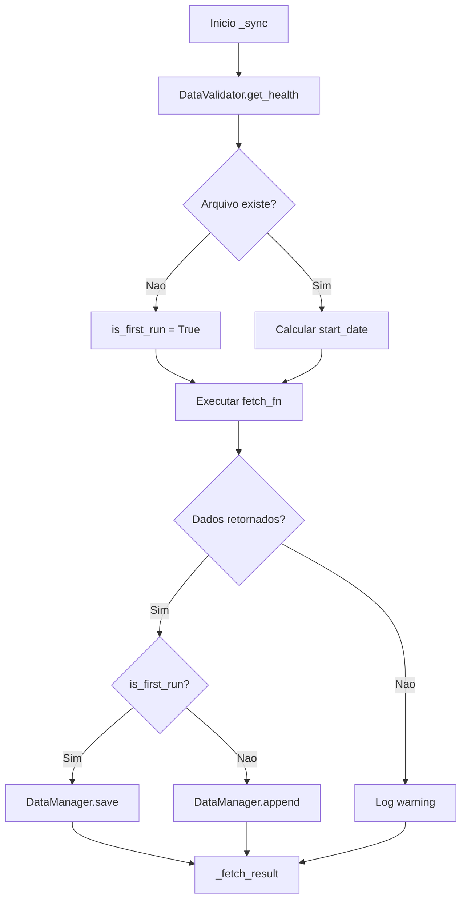
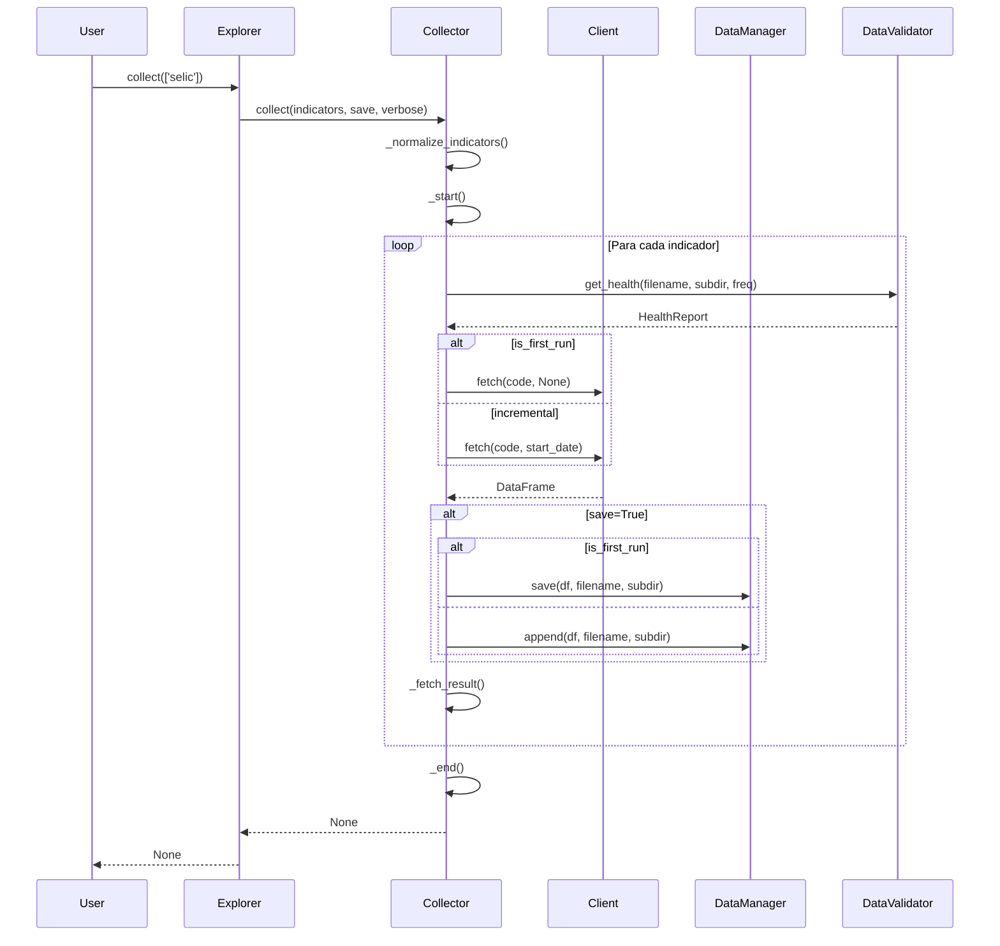

# Camada de Servicos

Documentacao da camada `services/` - logica de aplicacao e coleta de dados.

---

## Visao Geral

A camada de servicos contem:

| Modulo | Arquivo | Responsabilidade |
|--------|---------|------------------|
| **BaseCollector** | `collectors/base.py` | Classe base para coletores |
| **Registry** | `collectors/registry.py` | Mapeamento de collectors |

```
services/
├── __init__.py
└── collectors/
    ├── __init__.py
    ├── base.py       # BaseCollector
    └── registry.py   # Registro de collectors
```

---

## BaseCollector

**Localizacao:** `src/adb/services/collectors/base.py`

Classe base abstrata para todos os coletores de dados. Usa o padrao **Template Method**: o metodo `collect()` define o esqueleto do algoritmo (normalize -> start -> loop -> end), e subclasses customizam apenas os pontos de extensao.

### Responsabilidades

- Template method `collect()` com fluxo padronizado
- Inicializacao padronizada com DataManager
- Logging padronizado (arquivo + console)
- Coleta incremental automatica via `_sync()`
- Status de arquivos salvos via `get_status()` com subdirs auto-derivados

### Atributos de Classe

Subclasses **devem** definir:

| Atributo | Tipo | Descricao |
|----------|------|-----------|
| `_CONFIG` | `dict` | Dicionario de configuracao de indicadores do provider |
| `_TITLE` | `str` | Titulo para banner de coleta (ex: "BACEN - SGS") |
| `default_subdir` | `str` | Subdiretorio padrao para operacoes |

```python
class SGSCollector(BaseCollector):
    _CONFIG = SGS_CONFIG
    _TITLE = "BACEN - Sistema Gerenciador de Series"
    default_subdir = 'bacen/sgs/daily'
```

### Inicializacao

```python
class BaseCollector:
    def __init__(self, data_path: Path = None):
        """
        Args:
            data_path: Caminho para data/ (opcional, usa get_settings().data_dir se None)
        """
```

**Componentes inicializados:**
- `data_manager`: DataManager com DisplayCallback
- `logger`: Logger loguru para arquivo
- `display`: Display singleton para console
- `_collect_total`: Acumulador de registros coletados

```python
from adb.services.collectors import BaseCollector

class MyCollector(BaseCollector):
    default_subdir = 'minha_fonte/daily'

    def __init__(self, data_path=None):
        super().__init__(data_path)
        # Inicializacoes especificas
        self.client = MyClient()
```

---

### Metodos Publicos

#### get_status()

Retorna DataFrame com status dos arquivos salvos.

```python
def get_status(self, subdir: str = None) -> pd.DataFrame
```

| Parametro | Descricao |
|-----------|-----------|
| `subdir` | Subdiretorio especifico (default: agrega todos auto-derivados do `_CONFIG`) |

**Comportamento:**
- Sem `subdir`: itera todos os indicadores do `_CONFIG`, usa `_subdir_for()` para derivar subdirs unicos, e agrega status de todos eles. Subclasses **nao** precisam sobrescrever `get_status()` com listas hardcoded de subdirs.
- Com `subdir`: retorna status apenas daquele subdiretorio.

**Colunas retornadas:**

| Coluna | Tipo | Descricao |
|--------|------|-----------|
| `arquivo` | `str` | Nome do indicador |
| `subdir` | `str` | Subdiretorio |
| `registros` | `int` | Numero de linhas |
| `primeira_data` | `date` | Data inicial |
| `ultima_data` | `date` | Data final |
| `cobertura` | `float` | Percentual 0-100 |
| `gaps` | `int` | Numero de lacunas |
| `status` | `str` | 'OK', 'STALE', 'GAPS', 'MISSING' |

```python
collector = SGSCollector()
status_df = collector.get_status()  # Agrega daily + monthly automaticamente
print(status_df)
```

> **Importante:** Subclasses devem implementar `_get_frequency_for_file()` para que o DataValidator calcule corretamente as metricas.

---

### Metodos de Display

Metodos para output visual (console) e tecnico (arquivo):

#### _fetch_start()

Exibe inicio de fetch de indicador.

```python
def _fetch_start(self, name: str, start_date: str = None, verbose: bool = True)
```

```python
self._fetch_start("selic", "2024-01-01", verbose=True)
# Console: "[blue]selic[/blue] desde 2024-01-01..."
# Log: "Fetch start: selic, since=2024-01-01"
```

---

#### _fetch_result()

Exibe resultado de fetch.

```python
def _fetch_result(self, name: str, count: int, verbose: bool = True)
```

```python
self._fetch_result("selic", 275, verbose=True)
# Console: "275 registros"
# Log: "Fetch OK: selic, 275 registros"
```

> Acumula automaticamente em `_collect_total`.

---

#### _info(), _warning()

Mensagens informativas e avisos.

```python
self._info("Processando lote 1/5")
self._warning("Dados parciais retornados")
```

---

#### _start(), _end()

Banners de inicio e fim de coleta.

```python
def _start(
    self,
    title: str,
    num_indicators: int,
    subdir: str = None,
    check_first_run: bool = False,
    verbose: bool = True
)

def _end(self, verbose: bool = True)
```

```python
self._start("BACEN - SGS", num_indicators=5, check_first_run=True, verbose=True)
# Console: Banner com titulo e contagem

# ... coleta ...

self._end(verbose=True)
# Console: Banner de conclusao com total acumulado
```

---

### Metodos Auxiliares (Protegidos)

#### _normalize_indicators()

Normaliza entrada de indicadores para lista.

```python
def _normalize_indicators(
    self,
    indicators: list[str] | str,
    config: dict
) -> list[str]
```

| Entrada | Saida |
|---------|-------|
| `'all'` | `list(config.keys())` |
| `'selic'` | `['selic']` |
| `['selic', 'cdi']` | `['selic', 'cdi']` |

```python
keys = self._normalize_indicators('all', SGS_CONFIG)
# ['selic', 'cdi', 'ipca', ...]

keys = self._normalize_indicators('selic', SGS_CONFIG)
# ['selic']
```

---

#### _next_date()

Calcula proxima data esperada baseada na ultima data salva.

```python
def _next_date(
    self,
    last_date: pd.Timestamp | None,
    frequency: str
) -> str | None
```

| Frequencia | Logica |
|------------|--------|
| `'daily'` | Dia seguinte |
| `'monthly'` | Primeiro dia do proximo mes |
| `'quarterly'` | Primeiro dia do proximo trimestre |

```python
next_date = self._next_date(pd.Timestamp('2024-01-31'), 'monthly')
# '2024-02-01'

next_date = self._next_date(pd.Timestamp('2024-03-31'), 'quarterly')
# '2024-04-01'
```

---

#### _sync()

Template principal para coleta incremental. Orquestra todo o fluxo.

```python
def _sync(
    self,
    fetch_fn,
    filename: str,
    name: str,
    subdir: str,
    frequency: str = 'daily',
    save: bool = True,
    verbose: bool = True,
) -> None
```

| Parametro | Descricao |
|-----------|-----------|
| `fetch_fn` | Funcao que recebe `start_date` e retorna DataFrame |
| `filename` | Nome do arquivo (sem extensao) |
| `name` | Nome para exibicao |
| `subdir` | Subdiretorio dentro de data/ |
| `frequency` | 'daily', 'monthly' ou 'quarterly' |
| `save` | Se True, persiste resultados |
| `verbose` | Se True, exibe progresso |

**Fluxo interno:**



```python
# Subclasse so implementa _collect_one() - collect() e herdado do BaseCollector:

def _collect_one(self, key: str, config: dict, save: bool, verbose: bool) -> None:
    frequency = config.get('frequency', 'daily')
    subdir = self._subdir_for(key)

    self._sync(
        fetch_fn=lambda start, c=config['code']: self.client.fetch(c, start),
        filename=key,
        name=config['name'],
        subdir=subdir,
        frequency=frequency,
        save=save,
        verbose=verbose,
    )
```

---

#### _get_frequency_for_file()

Retorna frequencia de um indicador pelo nome do arquivo.

```python
def _get_frequency_for_file(self, filename: str) -> str | None
```

**Subclasses devem sobrescrever** para retornar a frequencia correta:

```python
class SGSCollector(BaseCollector):
    def _get_frequency_for_file(self, filename: str) -> str | None:
        if filename in SGS_CONFIG:
            return SGS_CONFIG[filename].get('frequency', 'daily')
        return None
```

---

### Template de Implementacao

Exemplo completo de como implementar um novo collector usando o template method:

```python
from pathlib import Path
from adb.services.collectors import BaseCollector
from adb.infra.resilience import retry

# 1. Configuracao de indicadores
MY_CONFIG = {
    'indicador1': {
        'name': 'Meu Indicador 1',
        'code': 123,
        'frequency': 'daily',
    },
    'indicador2': {
        'name': 'Meu Indicador 2',
        'code': 456,
        'frequency': 'monthly',
    },
}


# 2. Client para API externa
class MyClient:
    @retry(max_attempts=3, delay=1.0)
    def fetch(self, code: int, start_date: str = None) -> pd.DataFrame:
        """Busca dados da API com retry automatico."""
        params = {'codigo': code}
        if start_date:
            params['inicio'] = start_date

        response = httpx.get('https://api.exemplo.com/dados', params=params)
        response.raise_for_status()

        return pd.DataFrame(response.json())


# 3. Collector (template method - nao sobrescreve collect())
class MyCollector(BaseCollector):
    _CONFIG = MY_CONFIG
    _TITLE = "Minha Fonte de Dados"
    default_subdir = 'minha_fonte/daily'

    def __init__(self, data_path: Path | None = None):
        super().__init__(data_path)
        self.client = MyClient()

    def _collect_one(self, key: str, config: dict, save: bool, verbose: bool) -> None:
        """Coleta um indicador individual."""
        frequency = config.get('frequency', 'daily')
        subdir = self._subdir_for(key)

        self._sync(
            fetch_fn=lambda start, c=config['code']: self.client.fetch(c, start),
            filename=key,
            name=config['name'],
            subdir=subdir,
            frequency=frequency,
            save=save,
            verbose=verbose,
        )

    def _subdir_for(self, key: str) -> str:
        """Subdir dinamico baseado na frequencia."""
        freq = self._CONFIG[key].get('frequency', 'daily')
        return f'minha_fonte/{freq}'

    def _get_frequency_for_file(self, filename: str) -> str | None:
        """Retorna frequencia do indicador para validacao."""
        if filename in MY_CONFIG:
            return MY_CONFIG[filename].get('frequency', 'daily')
        return None
```

---

## Registry

**Localizacao:** `src/adb/services/collectors/registry.py`

Registro interno de collectors para import dinamico.

### Mapeamento

```python
_COLLECTOR_MAP = {
    'sgs': ('bacen.sgs.collector', 'SGSCollector'),
    'expectations': ('bacen.expectations.collector', 'ExpectationsCollector'),
    'ipea': ('ipea.collector', 'IPEACollector'),
    'bloomberg': ('bloomberg.collector', 'BloombergCollector'),
    'sidra': ('ibge.sidra.collector', 'SidraCollector'),
}
```

### _get_collector()

Importa e retorna classe do collector (uso interno).

```python
def _get_collector(name: str):
    """
    Args:
        name: Nome do collector ('sgs', 'ipea', etc)

    Returns:
        Classe do collector

    Raises:
        ValueError: Se collector nao encontrado
    """
```

```python
from adb.services.collectors.registry import _get_collector

SGSCollector = _get_collector('sgs')
collector = SGSCollector()
collector.collect(['selic'])
```

### Adicionar Novo Collector

Para registrar um novo collector:

1. Crie o modulo em `providers/nova_fonte/`
2. Implemente `collector.py` com classe que herda de `BaseCollector`
3. Adicione entrada no `_COLLECTOR_MAP`:

```python
_COLLECTOR_MAP = {
    # ... existentes ...
    'nova_fonte': ('nova_fonte.collector', 'NovaFonteCollector'),
}
```

---

## Diagrama de Sequencia

Fluxo tipico de coleta:



---

## Imports Recomendados

```python
# Para criar novos collectors
from adb.services.collectors import BaseCollector

# Para acesso interno ao registry
from adb.services.collectors.registry import _get_collector
```

---

## Documentacao Relacionada

| Doc | Conteudo |
|-----|----------|
| [architecture.md](architecture.md) | Visao geral da arquitetura |
| [domain.md](domain.md) | BaseExplorer, Exceptions |
| [infra.md](infra.md) | Config, Log, Resilience, Persistence |
